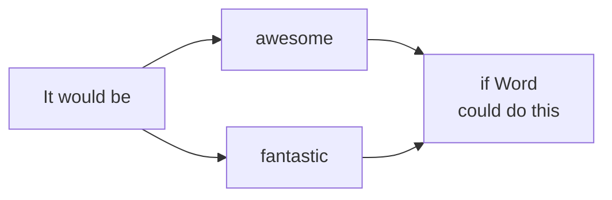

# SmallDocs

A SmallDoc is a new kind of document. They're written by the agents you already use. Developers, scientists and analysts who work agentically use them to go deeper, think clearer and collaborate faster.

Works with Claude · Codex · Cursor · Gemini · Antigravity · opencode · Pi

```
curl -fsSL https://smalldocs.org/install | sh
sdoc README.md
```

You're reading a SmallDoc right now. The same plain-text file can become any of the things below, live in the browser and shareable as a link.

## What a plain-text file can be

:::grid cols=2
:::card
### Charts, like a spreadsheet
```chart
{
  "type": "bar",
  "title": "Spend on AI agents",
  "subtitle": "Market size, USD billions - roughly 8 in 2025, ~294 by 2035",
  "labels": ["2025", "2026", "2030", "2035"],
  "values": [7.9, 11.5, 52, 294],
  "yAxis": "USD (billions)",
  "prefix": "$",
  "dataLabels": true
}
```
:::
:::card
### Sheets you can edit
```cells
format: B=, C=, D=%.0
Week,Visits,New visitors,Returning share
W19,7882,6923,=(B2-C2)/B2
W20,1280,736,=(B3-C3)/B3
W21,708,352,=(B4-C4)/B4
W22,560,324,=(B5-C5)/B5
Total,=SUM(B2:B5),=SUM(C2:C5),=(B6-C6)/B6
```
:::
:::card
### Slides you can present
~~~slide
grid 100 56.25
r 12 16 76 4 text=caption align=left color=#e0701e | A NEW TYPE OF DOCUMENT
r 12 21 76 11 text=title align=left color=#1c1a17 | SmallDocs
r 12.5 33.5 14 0.6 fill=#4d65ff
r 12 36.5 76 6 text=subtitle align=left color=#8a8378 | Word, a spreadsheet and PowerPoint, in one plain-text file
~~~
:::
:::card
### Diagrams

:::
:::

Each block above is the real feature, not a screenshot. Open a sheet to edit it, present a slide full-screen, or expand a diagram. Everything still travels inside one Markdown file.

## See it in motion

```video
src: /public/homepage/demo-web.mp4
poster: /public/homepage/demo-poster.jpg
caption: A SmallDoc, from plain text to a styled, shareable document.
```

## Free for personal use

Install SmallDocs and your agent can turn any `.md` file into a document you can read, style and share. Nothing reaches a server unless you choose to share or save.

```
curl -fsSL https://smalldocs.org/install | sh
```

```
sdoc README.md            # open it, styled, in the browser
sdoc bridge notes.md      # edit live while your agent writes
sdoc share report.md      # copy an encrypted link to send
```

Or just tell your agent to "sdoc it".

## SmallDocs for teams

Shared style libraries, central distribution of company-standard documents, and SSO. If your team works with coding agents and wants to move faster, [get in touch](mailto:hello@smalldocs.org).

---

[GitHub](https://github.com/espressoplease/smalldocs) · [Trust](https://smalldocs.org/trust) · [Privacy](https://smalldocs.org/privacy) · [What's new](https://smalldocs.org/blogs/new-home)
