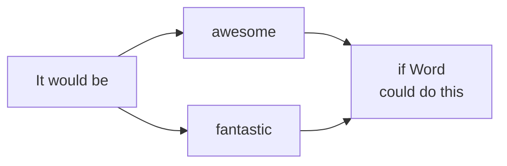
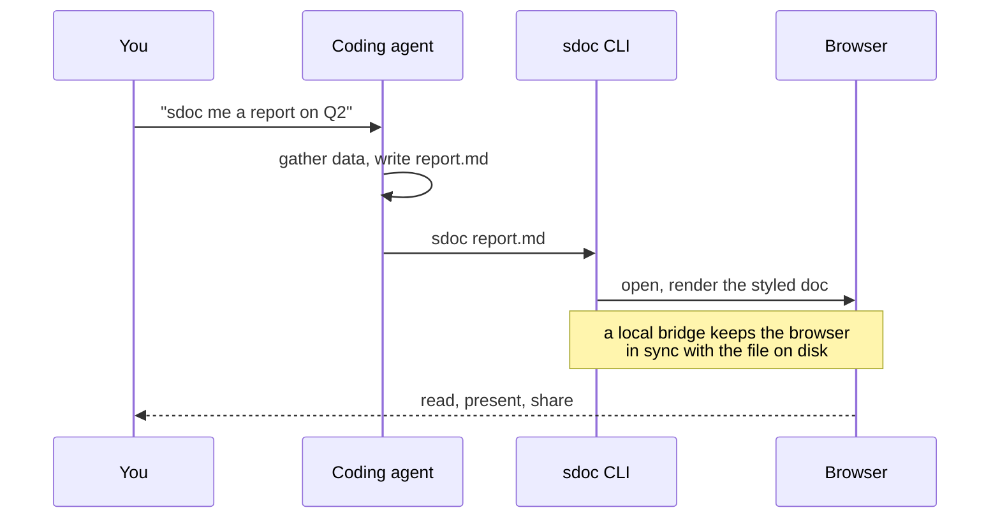

# A SmallDoc is a new type of document

One plain-text file that reads like a Word document, charts like a spreadsheet, and presents like a PowerPoint - with additions no traditional document format can do.

## Some of the things a SmallDoc can do:

### Renders text, like a Word doc

Very obvious, because you're reading it: headings, links, block-quotes etc. But markdown lets you style Markdown documents in remarkable ways.


(Check out: [Letters](https://smalldocs.org/#md=G9UHAJwHti1qt_BRaYTFBQs3-TXn19NUb7iQEFNor7Ipl6T-ADeyl6BqR34H8vcT5yslkYVNDaIgMzMVQNrgPxxjVFIzK4la391HRbchSa1Rkoakr9Hq8jOwMBAHA3ekKAoB3bfQOmhqSY_gVilCPLwEmPQEAPzydJIU4AtErBBGWr7IKMBBiWqsjp56Aanjlbx4NiGZBBlQKu6RCqox3FsrKJdQyHzpXunM8a9sfD31TuIHe227e-Vx6wG6YHb12GU2R7GobIsvavp_Vn_dEt7piW4-ievY0recacZxlEp67l4owbpDIJ7HKGV_jRysH0Mr_W0xa6kX0x6p9Z_Ae7ztpnmW6n8u8HO3oVwpNbX11LVJ-Dec96GWwj2ro9q15R46cw6GzNmZvEEySjpXoqGK6il8nAnGBv-PKPGEMLMzTa6zXPGftKAC4HTNhyIwfs_rxsYMx0G9wJOoLtWGKjTd4X6qwOBJmUWzoG10XbK5IEjVxaCvwzspMvBLGXlXtNbZjQk6PWaSFO9AiYOiUzQhAhZuzkHLihGbGPV0j_yAHaEu3fYjbsJ09mHErIonlovSzigolaTyQnfNwVo0GK9ZXxyMPxZXO8Ev5fjC2mYjrqP_SHGDNY0NgiiZyMVqut1TdNhO3VUubSA2uoKCx5EVtgqaO1HnQMW_MWHVKzd0-WCyREndvadf1ipcLS62SC_G_TF75tsRNwyxtNKMHvhFkINe264APrECX1a_cm_SjqFlBckHWaLJgjQeoJtTYhJ9tF8I2yoPYlDjNPWH8tkrrPbQTFHtLpqG99LpFV5-_B6C8Lb6koxWUAilMUaUJa5DMMezttiJYHB_b11_3bVrjBlmWjgwHpVT9xhXqsn1ZMFfcB4iYyis1bcSB6X2v58dFRyY14h62yA2_CHoSYkXYKPEKtpwAuDOar_gT-yUZwZxmBU-ZVgtcown5nZBuV7fSWHRXNMRDHlcckHfy-mPklaFpLjNWA7VBvg73Oh723W83BETi0bU_DPvhk8dVqhqGPc5ylewUzRLMNBvswSDOc5H1QE&theme=light) | [Investor Update](https://smalldocs.org/#md=GyYLAJwHtpuVQYhvYSgo1IWbrqlZT1Pt4JAEwwLKlWP1OaEDnbkELzg7F13jBjSUnNQgCixES2HP73-_ds4mS5TmiZIWato7M_-tOiQxn4eoJQ6JqElKIxYeQ7X_eR5iKITUbK2MMWK7p0Pfa74ZYMkZKZwVBmUpSXlLF0COMiCM7FAaQEwgZgWBpJEdLAkIVMQ1ysirjxlCnkqdR1-yk7Ui_DFBcF0Wxtr4ju6MwzBKTT3v43jj8Foll8VHsa_LS40QzuusE7puQD6BXJVb_9oOeku1zIjSMBw3S6Yg2poDDnBUvr6hazlUdGA9YARg5pBQKNhbUP81dAdRttrS2FGpE2TjzgW-9XmgbMbCQKfURSh11lWNse2_JQa0qqLBdqKTrhkFjdCuUzLYHS8JreCcNjOMo1M5cqJZuZy-MEUb7Ab1DKC4dPSqSxQ4rjA2_cKgUWFbGbga2yieldtD7Q8sRyQbZok1GjPYf83XlpIqdtIdqFwtxPGxyF6weynd-w6nj9Nh2rBsT_yURwtzyPlhm0P5NTAU3o_q06v-HwLifyN-wdVEyeBFOCqvlWmn_2cbQTV78D685_DpNhAb6eixsenIFoRYI7Z5IhkmNaFLsEX7E9w6-C1IUN3aGdnZ0WYhVJvSsj_Pp2sHa3_HzBBUR_pelf6DkbcmATZ7gf_t9MMH8Bt4jz2fDxJswi1o3OPIv3__AGsESQCobsfA9gcbtvPrzTbTwqTJ59WW84KjgOzLvteWCNmG0vbATxqHFlqg0pl4DbHNCGtf8ImjwTLy2wfG2K5hGguyeXbraG2Bm2OXBndTZfG2nqmbYTTjlLaqbb22p6PuucvSvZia6Us4kpwwJO2OGfKcFZT9IiBIIxs-cyvwiZGeIYRxW1gObMhY9WIhu42MAmrIQNOOyN5NXKlB300kl2DaMlM4xWf0xyjgbv_CUGZTv8yYHxIPfB3FC5diCEFk7oX6D99qwuPW7WZ-My_7qwYzFTsl-yV4Mdh2FIb7WrM0JEBqXcOAhgwpILSqTcllF4Q5Yo9-hGn76lM4K_jwoBeD8iC7wMaAwDXwPL8a1W5dodC_sVsLjmfP_emdTys1u0KWhi4bgLJ-AhWp81Z951lGQDwZh86LHw5yRI_YMeMVXLmBE5onmk3MKxFem4lYHeidVKcv74BGQb00dBSG1dGhCRpRk8ZLB31jDWpFE-ohvl42bI6_GGsmAjmcsnSIWnJ6agFU4kbBMu9zeBMy3LtMd0FbhXTOcsAdTA50TT9IcsAOMsE5djY3rXyMzoLm16iB0Na3sww9uuG5NBD5qocSCE7Y5-Vo7n-0hsgaY0LOVJ7CFoG6ubJPQZV1c4qzpUzfMnhIGjWb2oS58-3K5DDdQz-SEHbu4rJI8OWWpnQc8RnO8NDppkwwDT9UIE8kyKFIlT7wTKzRMQVgaGeazN8IA3EKKSDG98ibloPVCvjx9P2CUoYOcG0ymyUhJ6kw4j26w3DgjvGPboFtEM6t1s2WsLeULi4kEQ&theme=light) | [Lisbon](https://smalldocs.org/#md=G0MNIJwH2SnzJNPvVHCBYHHTpur7O5cJJ6fy9OhW0tqvZYZEyEYsAToCSvo-vUptbRAFlbahAP_9T_8nFL57NF1YrGTPPRlWLjV5tNCH0lryKKU5FAuhnv6lqyYFjyNpjGGXXAmd33zzkIPjOKleLFM8E0kGFviFrVGpQobjFEBBJvjP6qT6a2r4WgWABo3eqrgy0tUny30AEUpV47plOgSAHH-wk68Byaj24ToW-BvFqlop4-3AsobSlj7IxUXa1jCOY6hqRtsjtV0F30PPy4A9EQdWafenjdeEm7fP5XjViYA_59UNkOPR4xq06Pa7HVU17GxOKvRL8VOM3HfmqRs4yxvCvKjSvMay2-IaDU6Gi3hOINr2yu0DO2yWh31V_ymp73zdpo5k8Wq3WbTpOl-52q122w8C3N68XtFqf6jS8w4sFyvWuALTQYq-sa2yyEtcrtv3q7QHWreLLiq4kwuHXXs4hl1A1P--Hu5z02zedOW5P_wubIkwvz5Nyct135Jeb7ldHZat56cbLM_PymvdcXW7yrK2dtO81Df93dn0XIUK-bswg7o4VPjnowJKBuQgWOBfal_QECo5v5R4I-yipJkA1ZAMMjE4wZJsXFY2I0fZtKDjhdls9XcZ3V3_Ev0sHH6YhoaKK7ym_oxZGYr20CVjK5IhNtlMGQ7HT8zCXfOi73BAvqn0Nm3rZ3lmzV1YacP6tQqyDkNwFKKeZmUYosGzJf-jXc6zCj1Py8fFGbxTmI6JkIcduGDWqWh4mi6ILrySF_iLsARppgMCbCk3Kq6GCkpuNJwdIrpYiPHX0AMy2lryw6JBVvhb-7Q4-cKQCJGHkQpjH3vtDJBwv9EQFWve-PvQV1a7Jn-zg4rJqmT1J3aw0XfTXTk8REF3WP4OzUG8SzvYbqn_G1AXXqvc9zG7VdYe44QFhdZuKk1p45G6hbyk_tYQ_kDzW2yQ6df_A-hwOK0XONR4YZZJgMaM_5e8Ii1gbCf0jYcDDRZA0hvujHxCCr1PE-OvKmhO5XOMaU6WBgXmG8JZtL3yXXt0Nm38Bwa2ThsDYJ2R8DvtnlCq14msZChmmrjHRFVKZtZ_lNvS8kjwF2EffpmkvQA62M87WosPhZVOd50L9z1lGP3QNMq_umdUR1ey9KX4054FX9VSxgJnc7F_uV0w-WARARnvdZVzoZxmKhH6VA2lyw4qphZCvwB7KiwTxPhiUp7WcMYexjSHKY7hOqUJS638PPRmaJA_YXa7HYVeF0bssbWjLkHc5s6uWvsf5ZWWK9yDV5pum4_Yr1-fP2Jmo5NzL9TDpplcOQJ0FQRQena0DORSaMsQruE1i1Cx4-Yfx9N6ASs1a202M75-LjH-U_ADmSFkhD8n4iFHOUmnWpwS8cyores4Wa29EBnVta_RAW8y059jLAR2LXK5__10Lj_jir0D1w7OVOH2THIHjGFtZQL7FkVfLa9NHkgeNH_GjWhOPWQCQcdIPDKqKeXPxceRI0UKk99zxSJnPLV7VKVLlyhs48dlmapSJlJThR9Gi3F1iAM2wE5wHJyHsZCbrhQNAcqcuMl1-CUTJuvchginmltpZ8Gv0zznCkw8Vk2jKSAbvCMH7ToAGS-aF-rvusarRM8tptGGu1SiJ8LxNwuw5w2e24gN64SU3WNWmApenXEDY_wFR4xxmL-Z7dHuyctel50dkAKEs-2OCwdViGRG8sKlhNZdT6I0ijv96_ELF2Wym8IqDoJEMSogi1p1-goPiDqtPxBuyD-SypwrjZJxHA7jgCbATv3fcEugC0jkAaCTcHM3CbdTT74LR968TGpE8DeLFwQ0QLgTrHvvtCWLjwpyeY2BFsjePzxr8mtX2S-LmlS_F9sBdW_a5hDPLO9ZLhhruUxyBeMI1eKYoUqnVABn7XLGCTlNf-1W8MGbUcmmG9OJ7li1YXemygA&theme=light) | [On Foot](https://smalldocs.org/#md=G8sPAJwFdptLwd1GjPOwYNhcSCGN8evUmTvLdHJKpdUtytTmZGoHPh4LbCPOwBeD1pX6bD1QDyDSL2foYxRXzTIgEGiV35OH7rOzbQWQtr0Q3y9rBziWR4jDFAiZgvArkRgXhLnt99_Oxr_pQlKEFOfPXVZXqBDtOXA5aYwTLIe6fzQliDgjdAd9_6VAH2iC30S4bU0Pyj2iWPZAA8ARnd9_uQm1dVI8iAKgtVXKuISvXgIy6J5vN31HQIH7WQ2PK7iqhtA040sgnHlvfMBfHx9rQQ2nOU1CbdAbRjHTlSep8hqjVv_GbEQl2uZNqzytMu8C7JjcIdvjkZwT418lWc3cj2cg1sIkqNGhpF6gZMaszvX9qwZbZOQjyUConbYZej7O6LBk4TA84rbOhH9FeafZiQL7iO-kbwgEcPysGV-SPdVbGhJJJotSwzTr7h3BPbRpzwm7miiclFzdHiqHKjLx24qFO1P6uNWuMlt9SB0JzCW-ZX1OzfH7EGC7UWY1q9E85JI7n3XIfTzOv893FCNde-GMRyzbZbWqc4zRVXfhEWfsiV1ZwwYKqt-7StuxL0lbf9iNByZFCXAPKQTC2sWeHBY0WQWqChGDWToCZSoQWKq3cZ3EIkQ18vxRm0komPJsV0h8WPXwVvz7Bzs7pRUrcwA0Mk9AWkUlkB5WyFWv8rANzYb8yzp7wlWvEzq10XR6Li8X_cTjI2MWAqP-RmLUKlgXxyr2l0_FrTXgLHyRUVYoO7AD0tz9577opTgdaXAmD2YpUkt2mmzPYxwoyxeVUX_iHoCQ6XjzBVgthAJV4XVcUxYZhlFjjJM7QGWyZd5_cSIKNAIBCbUf4xouK_w5ruFpXbGahVPsr4e4Q3Pc6Fxct9vJiDrxZgrcd5jJHZXY6heTQU9LeNuj3jq2D-i5lSDwPT5EgmkkKkVSi0g2ihSXSD2prfN1kIKua0XjQg15Q4AITSumqGN4hnDimvA7h13YTXvliApYqHLSgUVdxMELUrFUaA2d1xwqsZJLewzF9Ld_wRZ5IImLiq9MM8gH4Y86mmMmaxLP713jgm6wRldnwXZ56ENJmwJ5__ZrPKHvUk_dOtgnWoHBGWeD8rIWAtkIAw5bgIDdpgXK_oVhfJeSh6veADXgyBDqfurV5h4bwT5sjcuOHzfua0_QxQohP_uxombj7krxgGTcHdY4WVTcQTfcWQ0lBgRWiWnruCBI_Cw8KvzzlCEICn3m_fJSjM7YKAP7-0-08JKiw1ccGSWk62gU4XfVudICLvWsi5mZJFk4iwORK7OtERHKQVmGpSMdEzvQxI4ahltGz4bWXle38r4ZO3mSeOjPiiuj11EHBafKGC3lpkcMeS4gmipW3rA0Gh1wY5ouXlqPD5Ku0hlL-oi2ElZtsVxxVTPGRhmktbKugTUgEc1N_vfvtTLhqB_YGZ6QwcrOKWp3hE_LLZarLW-0XGQ50wqKrQVBrqetiMjJveiNjXndBfTqHIMd3wEekaupLMPjo9RK1JxmFtAcAwvQdHlDRorKNhgucAVG9k2WG0FfwEDOY_PbzrUj2qynNhrAfKWrJP7sbOzhbgb_squPQPy915s7mCcEZDEuT6OZxTwF5PbXC17iUhRvcfVqD6qJiUoTly5NTExUuriIdFExaRIP8vPG9C3p-nD4o91orDOz3ed6wwzLeT6bZsiFMOLCEkJiYuIzCfL7vWt36jTgyN55dhUhz6bL2Ses6A1Mel_Y3otOiaqna4gkmZL1VSZTfwLVHqQaxRBkldH7maQuJ5ydXLBJEYLOhwmZ6E2QkzZkQ8RP5eaNCmYVQbTA1BZZ9Q5AB1pJv02cK7vQcIMgDLSgMNwWa7Rhal5yvDw2GPVTkFJYhs6KGw57-Drmkr51jn-0cBCp_COkjoOkoq697alcue46SFfp-z0as2B5XOwXvo7q48Qh5LEC6InpFCg_6rPYbofbEZeJVXkEMUMdormwjv5BWRU&theme=light))

### Analyses data, like a spreadsheet

Real numbers from smalldocs.org's own analytics. The Returning share column and the Total row are formulas, computed live - select a range for quick stats, sort a column, or download the sheet as an Excel workbook with the formulas still working.

```cells
format: B=, C=, D=%.0
Week,Visits,New visitors,Returning share
W19,7882,6923,=(B2-C2)/B2
W20,1280,736,=(B3-C3)/B3
W21,708,352,=(B4-C4)/B4
W22,560,324,=(B5-C5)/B5
Total,=SUM(B2:B5),=SUM(C2:C5),=(B6-C6)/B6
```

And the same file charts that data:

```chart
{
  "type": "bar",
  "title": "Spend on AI agents",
  "subtitle": "Market size, USD billions - roughly 8 in 2025, ~294 by 2035",
  "labels": ["2025", "2026", "2030", "2035"],
  "values": [7.9, 11.5, 52, 294],
  "yAxis": "USD (billions)",
  "prefix": "$",
  "dataLabels": true
}
```

```chart
{
  "type": "line",
  "title": "Returning visits by cohort",
  "subtitle": "Each line is a weekly cohort of smalldocs.org visitors over time",
  "labels": ["W16", "W17", "W18", "W19", "W20", "W21"],
  "datasets": [
    { "label": "W15 cohort", "values": [496, 213, 148, 504, 164, 135] },
    { "label": "W16 cohort", "values": [null, 353, 155, 308, 68, 57] },
    { "label": "W17 cohort", "values": [null, null, 40, 80, 30, 31] },
    { "label": "W18 cohort", "values": [null, null, null, 17, 6, 7] },
    { "label": "W19 cohort", "values": [null, null, null, null, 273, 89] },
    { "label": "W20 cohort", "values": [null, null, null, null, null, 34] }
  ],
  "yAxis": "Visits",
  "tension": 0.3,
  "dataLabels": false
}
```

SmallDocs supports 13 chart types. See the [full chart gallery](https://smalldocs.org/#md=G8UnAKyOt00DlHxWwjviQk58bNCHEZLMXjp1Z5n-3q1jp40U95IpNFHcxOkFh_Y1qbAHS6AbpMeoS_XEWiiA0suU-rzqL37KktMl6bZ160MSNPnhJPlKXrJ09TWLjkJX_7-1L8-6qsGeYTkr162RG2AVGeFzfLpeve6p1_V_D3CAqW91fVzCH2JFLAlUpGKrV8oguDEUlwaE3m6ZiM4W9xBWoM20RmRHHvB9eAlum_tUt5sls6pxXJDETdoI1mtn4ygyK3NKOiDQfOMfNkoleCUMqvDDsyh-Z1LjOM5yd7Tw-HQs0oShCG-aYfWyjiZSkatREH4PYX_RHNIDUBzd8FwnLPMdFKXBrkbxt5O4-oJeM-eDt5AHa9257284ROtNm9q3phEcD9cNugOB6wddF5TQBQ0o4fpBJ-BY1U9XTT9Qx61GwMkqy2zZlA3jqRh4qm4L16Agw_5OhebMz1aw6TN4qNpsU3OpeF_5RiZSediQfbXhw3sojD3QhC4QCLNQD5PkcjjqbKgnFbzm2xXK7SiVytxe6WEtm8_0XMFhbubs2qeChsZ2XUeZN8nK5DeReXVO8FuXcuFQFDfsB5fNkD40lBGzzRZo7Ffa_Wf6HSyW2X0JYjXztCBU9pr2nNpbqEZR-UsShVEkREQ6G2pohRhrMtIra6wwWs7EHBRxmEH0We0PAlAfLKMKKMDDmYPuuf41-AA3GthWgoDD4VikdsZzk1KSPZHUTpsNAfOzBBozpoABOV-7IFfIVMUBG6ODFRPd5-9eTVxku32Vwqaoc1AP7WFip2SskyZCysbQZGldmfKtfzAjCfUWrnG-9BAtrNQqKq8brS1ARlhxWiQFNSNATgm90IACPARNhf5JbL3J8iYJiAMpM4F-yGzGS_Mf7OBpkpC8WC1MXGnTHp2wCJzWxE5R5RUbOVnyCab_6MbBxp2WX-1rIHlH2HtiYqH7ZyveX6iX1w2DgaxBHQiz5-ywBTnDsNfUqfoyY6rcK8HxDS0MeEZgJVzUUJXqHhmRMQV8bdVmmGZbIAajEu--k9yjKWr10qT2qgppMopso5SBb5MVJHlpuPfKhAl4SZyQQTHDrpkwLxWR7hIjNb9rdfUie3_q50syskidaYWBu_BofhiS9mSl9sRUshL010gZF0MHmn8bpR-LPnwlOohd1GgqYg-qnL26UvyJWIkKDOwMx3fxLMUzs9WDBw8ePHgQaHUzYEaX4KGAAgoooIACBOrVnThfQgECAgICAgICtRsBiwK1n8UBhtfkX5Lu156d-0VVx6-2dud2lUz-5tV6f9SRQD3-nj6_fnmJfv08OiNnZpCjGvGkHn1KlNHhW7ZwEm2s9Blo2-XciLHPJP5IZOFnJGmoTzl5TWhCE5rQhCaUcMwhFcUHN9NtyonuY2fKlYjGz5zwuuiUJBx9Cd24iLy99hL8OnFDSdqdKwt-n4izqyci2c8p5L8De1smbtsaOrW2sRSVG21R_LRNaJBsg8PQ6dI1XaErSR8jd26qVvXiwn3aM1VJhs43eMS1ZFTt5-Ap9q3TqjAzUZuYoR48ePDgQaBlk8Qcxp5uAgICAgICtYaIOY79kD6Usxkq2TSdQOzScglE2TVdExFD4U47ABs0KxGIs1_CnxskFUWMrOq1Kd4hR5_xAVi7jVSza4W9z6ailv3tYTbLtykdjBtolzrxTj2W7YlT-iXjOXoY_uzDQeNi4ynq60zuoQ9lNx7u_MGJPjK5eIsiGS9AdheUUEIX9ELLmslswGvxk-DTomTfeR7iCn6pT3UKd24D91WdeOjtu1Iy8Z5p6q0eTQPKYXNLb84Jrr8dCMrSVMLk8TTu9woslwiFHT4_A4c1fqfNMU2NxveIZ19OrQePHxV5sQl7hWJKGu-pYf9e6Rin5H26H4M1NTXY-3g3mFuvrfuvhoejcR2TPKJoTc25j7ewBGI0in7qoh8sEh5FM2Uz0ImIEeQJCDHlI0a1r2dNpeCiZkYXG435Yidn1teun0Px__MJfBFDsm35NiPtq5nhjIQhVgwvasz75NieY0brWNqvsK8G1QPNNqgI2O75F3_GpU0knaKPcTeufGqW9DpPQY3bgK96jQfWOftbC4nhnrU8dB2KKsJXo6gFnLas9m7IG5ufPmUkkewhyHCJCzZa4krQu6EPdEMTSqjz0oKHNi3CZzCWeUYM59nZRCMVYby2BfeeVos-W1vvtOposK-AENj5vdV4PuHtll17PtotJgllorG_EgWKNerXxHs8XhGFczlL6moURVh5WhTkUjb1_tfOYObbJRtHf3hvtT08QO0I86GEftAfUCeIHQ6HQEd8qraUs5mdmsk1GvN2wzApnCPV4rCUs2jq6Ld_FwNl_XCjAnl88mpuLxRljis2iknh_Vks_rdQvJI3lnxJ3CKZMpmZppL_K4m1v6Kewo6n-3NyBRwOh8MhgHJFyq8fdAJ2MPWOawad48xBd4LkUbf5kfwKRe1zr3OhtkorGPjF6dHHgbGbo5TqIJznaXAslG-G3cXSJ1fHgHtd8rSwhXXxyazphlr3ASvFq5ak7z1MJ-pDiNY-0AV9oQvqXO8q9SajpHWMYoSd0x7lRaiqxECQKkAF-MlVRKbLVO9Y_e0YBKkrRdFyk-63Acr8r_Par-fk4zNv4ysQdeyYrqg2y-86yGx7NLhBDSJud3i-4QG2KcD25wCEvfAY6eU6tdI87bnE05Bantv9KIVJdqbLVQbaQ_RtrUxarCQPLGtRVx9lrSt9MPCsLiajyQ_VxCHG8sFLjIzC0VuH5HRWZEWEJBeKtEu9gMMh0AWOut3QqiiD5j_owFsrWmMj0S4QiM2d8DimqQP4HRUn82wHPvH_VZq1oWRGXoCamq9pMXXHjctQyQCjCvY1rdqYW4HWWK2RFrtze25Mbdf0VurlZUOtS5cm2m7tfm2JbS4PIL08339eUWLhaNR9XcIukvT25yqELbQejcnb2dvPETgwJF4PkC_51mHY42hCCU0oIeRGSa388pcqKFYEt5q0oypb1DpSwIbf-_EZuKoO4yuVisSjHOlUGzB2q8OD04m0oi7lwRNva_wC2-10pqQjqbPcWXX3lt_XEGMsSow2Usgsfxr41vupbNiKIVvJ4uFtTD8iG8NmNszKdvuTWzWmzN0SChAQEBCoNZfM6xIKEBAQEKizicD5WLVHAXgwo7AvoKFhsbN8qzYO2RscCrgP6jxADvydlUyh_bwFIecm-d18mXV6CBAXTz2DpPojQax0AQ) for a live example of every one.

### Houses slides, like a PowerPoint

~~~slide
grid 100 56.25
r 12 16 76 4 text=caption align=left color=#e0701e | A NEW TYPE OF DOCUMENT
r 12 21 76 11 text=title align=left color=#1c1a17 | SmallDocs
r 12.5 33.5 14 0.6 fill=#4d65ff
r 12 36.5 76 6 text=subtitle align=left color=#8a8378 | Word, a spreadsheet and PowerPoint, in one plain-text file
~~~

~~~slide
grid 100 56.25 bg=#0e1330
r 6 4 88 3 text=caption align=left color=#f59e3b | ONE FILE, RENDERED EVERY WAY
r 6 7.5 88 5 text=subtitle align=left color=#ffffff | report.md
r 6 15 42 17 fill=#161b3d stroke=#39406f strokeWidth=0.02
r 9 17.5 30 2 text=caption align=left color=#9aa3c7 | CHART
r 11 24 4 4 fill=#ffd9b3
r 17 21 4 7 fill=#f59e3b
r 23 18.5 4 9.5 fill=#e0701e
r 29 22 4 6 fill=#4d65ff
r 35 19.5 4 8.5 fill=#7c8cff
r 52 15 42 17 fill=#161b3d stroke=#39406f strokeWidth=0.02
r 55 17.5 30 2 text=caption align=left color=#9aa3c7 | SLIDE
r 55 21 36 2.4 fill=#e0701e
r 55 24.5 36 1.2 fill=#39406f
r 55 26.5 28 1.2 fill=#39406f
r 55 28.5 32 1.2 fill=#39406f
r 6 34 42 17 fill=#161b3d stroke=#39406f strokeWidth=0.02
r 9 36.5 30 2 text=caption align=left color=#9aa3c7 | DIAGRAM
c 13 44 2 fill=#e0701e
c 24 44 2 fill=#f59e3b
c 35 44 2 fill=#4d65ff
a 15 44 22 44 color=#9aa3c7 strokeWidth=0.04
a 26 44 33 44 color=#9aa3c7 strokeWidth=0.04
r 52 34 42 17 fill=#0a0e24 stroke=#39406f strokeWidth=0.02
r 55 36.5 30 2 text=caption align=left color=#9aa3c7 | CODE
r 55 40 12 1.3 fill=#4d65ff
r 55 42.3 20 1.3 fill=#7c8cff
r 58 44.6 16 1.3 fill=#f59e3b
r 58 46.9 22 1.3 fill=#39406f
r 55 49.2 10 1.3 fill=#7c8cff
r 6 53 88 2.5 text=caption align=left color=#8a93b5 | Four documents, one source file - laid out with raw shapes, no design tool.
~~~

Slides are built from templates, or composed from raw shapes on a grid. See the [full slide gallery](https://smalldocs.org/#md=G2OUIDwMb4yQHjKyJLTGPZOGwEPQvsAJNUuliu4fZEMjJJn1v_3M__o1rZB4AZV9pVcORWWTiCNsm9kGURjLG7c-2KZ_53J6M0lHKN8kSGVCdOIwGlomhNoXux8-1JZhP021aH1dkzaNYgh58IPI23p_7_dpKmZS6X3ssnCgjHyVOtZ9F3h6lykXQd92lmnnjUq7sKDOgoJUTko3SzV7NNXaWZo7fsh8h9S7qDxzELUioYQf4vgyHaxU0x5NdZ0k23iHTBetm-LxOIoOwBKzt0z-974tq9qIGaZWLOttZnwQyvl4Y-NY46I-59z3NP-12fkNPaX-mFI3UpXoQRZkgFm9_5tGDUIUI8v6kdY4z0jRWpNF1oah5Ak3C9fpUF_xrCbudHCM7f25ih-Lp5QIxzW-tRkh3sqLJqs6cTZko81Fs0y-djGLrJLTNdPc7qVs_M5Yw3Z14SefIQDS8gY6qfUpME2IFCMpmEBR-3yGAQR9uyf6GG8gafrfYRoW31ERHR3MjuNBKJOzA9geLrIiIbwGzdEoFgFCMwyOQIZyP_PNQW_YKJ8DwHtQv3xBzJ3Xy5X49u1KI-4d-Y2fBkDErC79j62KeflcyRwBnw0JWmQw0d-hd12SJUydeqVZqsewB60qG8xY75W8TG90FWfseiyqzPmocJwVdsYsgxxRLDv2967SuswaVFTEf8z5ZWhAAS3o3FsWt8FgNqtBpd5tNJXshG9R0yG3xt6Z6q7Tx-FdtnD7g4YXcU-PHt_Ocy2PJWEx25MeUqm2REJm8Z3mGBjtOCLufEsIij-LMU0BAmygcIm33bt1nOTaidoc602admKA5pnpAV7LAZVJpTZTUDld9-Qh4PmJc-uDMOg3Cin5W7INueo0sLaWGexsfJ-sCf8bVEwTxr7yQQv9GOxiuzbHwR_NMwyWRqgpU0UdN_3HFCUYCV3WKp41pM8KuqX5MnccIJ8vHt9bq5mU0Qka13kBhsbbATT-aaS_UMKfJqu8axLWSEcIUvFT7PmTvFezqK2ticKufIyJFNOv8uNet063uWedYmcctqdtFi5wR6cHtUMASU-eqM6vMj-WYNEC9cQMudsRVHSqMzNOtZ9qMSDmSiqHiUf02p7pQc6LYpF7KyL_dwTv4hBT1Xu1TBoQHZ_mm1ur7OGhwUqcYds98hq1qaC-uNy3Ovp_loJ-Im2AWSlM0JD6nTtReCN4HUus0-HLs7fFJlXYSWd75OeesN3Fe7YS6bFtBeUqGInAOugmyL9iGi93Q41Wu6XZnvS8oZtpVKYws-OotWoDYdPBBwzxZsRsqC_zbxTKX7J8csRKkgREDNoDquUWzPt745trJ4rSPCr-5fdprQcS-RtOlfI8yqx1epSqn1mwT2XpN9ygTg7H4jfcDgbYmHbdZwjARypV_86YgnhvDollHea2vy9x9eRwJheQpxEoDwnaywbyJoVbpxbhMYQ-POpsEwe9Vij7KohhbEMHTGvk-Z8xaLinxrihrpLmY9UTiMoh1WCFo30BcF5h0Q-3YJj75pyWCPRc2AQ6Je0KOL57ZbCsjYmDv9ZEA5vIQbsNcqy4Rj_SpH6XynkwKlLlEH-calPOZkT4vatMuN6ayHWaLA784EKmFG4DPh_H-yc7BEL0Z4Wd896VQSSV3c-7ww59vd23owd3qAtn2frsXS3F477Ihep_b6u1tSDlsM3L_4lpeL5vkLqDdnf3uu1a7kJpwERaSnCksIsjUoSjjZLmYuu-hP_WawQBmxt88pB0wbgTKDWKX9VI9gtS4dqZing40Q7Afr2Pj5d7rnaSb1KorKqSgUprCIxqrbFzP1sQd6nrJdjGOyfUAqDdOXl1zdkhxwg9lTLvySHzyPaEobXvAjTGxajiNjoWRqPhIvUUXCPROI5ZsiSAUBtc-b_d2whL_Kh4AEl7Dm6nXp_zVsPzZwjn720fVT34MGn6MvfApno_qBZQ0mPzJ1XKNI5HmlTqpiGZx5zIB3Dpc43UI2OtkNtiFjmBcWEgwnt9QYYNqJ4pL0oYE-YlpsCjzh7TAhcGQ_5h30CLrKB2N70wD5HYolnXgoxTFZWc-aBIBQ8hxo_ooXQV1aAkollYoqkG_OLNtJfb36tc_Xy27YDN90ejdGJkEi-hVjcJxpwqh0vEiFzUP2ErwnpSdhCD5Hb1tNtsgBdqA8PCV1MI20Gt4ugTnxzOxUA_L1w4A8zmSA68286auEUHxORtgDwKGRXFvwG0KeJyEGC6YHhxh4wGbgmpT2un8JTEUUt6z81O8C0ldAVWwJJWgFOqApQuM4Do8i-eB_3rT4bP8igybeGPRGPoJMQhOIvY_YRRAtOAM30RtRA8BJN8UfdGL17FH64XDtwKaLBIT7XZZLedxmBWLPEtDRSyPKUi_mul9MhvlCcA8lrLY9hlBQkrFddiku0j-WuVIH4-Hl9vSy8ROVp-uXgwvjK7ZuNu5KLQ4yCbTK6T9ORe2xfX6Y-Df-YSTAz_EkLSddpFP21A81LuQAiAtrQI_etbYyhNjP1usEm6e9IajeTVkO-taQja93s2QXRHiVGYEbG2EbTqLjHoVOCm8wLdwfXQ5YZv7Ez3e2Q6Lywn57FwL5Iw8ts7iIxczVleCPm8yzJMJIRd2k7C-JAayS8IuhnyN2CMWOM3bK7yd4G8g-ObBBwn386_I77agz3cE6sFK38b5dVWVCt3DTG9HZouF6OpanhqZ0eQ_o6FqPvu4DM46YygT2x8HvV4CeOqe1pbCgDbSF8pG8OT6AbGwAja5D4Gb_1Pifut-2rFYuhsmvpfVizpRNQ9NKZRA-FMg7teSTywbzF3w31VhTLRRoQFBI_kLh7GUyZi7I75tCvZGomvYg0AlRUmRYCXD4ukSHGQ6pq4KqwK2LVeKTp03F-2eGv13BZWVTUsEcWFhDSN8cvg8zTyuZ0XMeTRt0GHN-b51DJjR5IwvFv6c1LyYp7JMT5fMaiFee948qgWR2cpzVzRGTXUA7dUO5ZIzKLEmNsocxm7c1oUXaukWfQSBA5MReyhWRCMumMtXFRWcB6pl5MVgUiXOeIvfMKDtFabNs5-dQfbxQFQamt_udiVBzmRYqyPQyOTI4UJRka60QKYYd9faY7sRNITEw0GgCrzUZ_gJBs-KMQAlFgOkKzkcxqpYgUsPqk6defNWmRNd5TTqF0p5jrUUp47YkWA8zMzaSc7habeAF8UFgTpStXzKnmKmtErjF0DkR0t-Vl2AJdPKt5VjiwaEELEKnkU4HEzPUPeRkeNfPe_8-ifwwScKUKYJ1NN_p4Mn8nN1Mm55cByg1ZHx0ZAM6EJKhYO5EOE8xjJWRlsWun520Co5E_JVwSXwiRLHdkRNZZczq2MBFTFllNLSTaEwKZL4HKeLYN83BOW_9ms5benfYuVLZMTgf4rWLIX_VsnE-6CI6AgQOM3vQltEZp2KDG_f8Y2CDd6bhz1I1UNd9WSGeS_vkUz_RXMXtENTA1lKkjcuwVTtOzzasdfhVf_CpaFtmzmaKPueB7gHer6__obz-SRlSPI3j_hRdMkgWIBAIE3UvmjgcY9UHuH92oGIAmI2cd21Niln1B38KiDF8ZLJ7rA5psDRprd7XnEOvMRwY-7hDERckhRsZC5zZK-wiEKjQkbzEjJS9G5hTyJmXnbSTVxnZk7EjnEtJrkmfRRccZyvo3opUl4tqo-tJuXqbayHMHDzC1aM2aQ4vEskuYp2H-_Ucr6fs4JuwSSTJI02e-RzvT5sfwSBw0aAxnrt0j5F8U0QtsyXiIe4bDtNJrPrLt-h_gDCAeJ-bb5pHYARmjieX4WScjd1Psruoq2bkFglaok2Yspvoz8pjiQ90xwb52aVZatt_Rad64ndEO3JCBOnQSYfogZziZhtl4eKoAP9ZyCjud8AuOtMdGg5rIuiXK-yqbeEjz3LN1OiHBqks-zSsAqhSmwfb8-csnS6HjC2loez38KEdAZ1fXKu9LuS6WWHL1TKoYV60jqG_8tbx_oWslbyMx8iYmzn6kHUT1cuWNKiDVvOHFGEoNxMDciUvUzbBH9LN52bFBcr8io2iv_lxPthahuVxr-e20eg3H3Dl0BIQ9hJ33GdJ6dhAV1-3eKag7_AJYQzzZP1bPbZzgDOMZdiA45JgkbPEDVgjKpDCgdww2TODTWcI3QhU-CtRMMgDqKfk_mHZM6Fs9kI4Sy220YEAlhgKn1AzoygucnGf-V8jOkyeZ48CW0015ETHZtbnRpUuwOfh2i8Q26_O1vTbdL3_32cP3xc55duV-OsIreenGmIW3ZFKtpVixdQfuWNOD2eljji4dy78JY5uJ7tJT_hNpnUJH_wCiGIzdGuZ8I9PG3c1hXTcUDFu11nb9wfsDmVLIMRF-rXlZB2WIl75fjJjcwIoJs1KfqLrCCWC49iQWRjdaLMYkXVmk4JfUGVLXnOrAoLP8TxhuNn-y5S3KNObzqMDdkbmS9PzTW8nfwGijmlUmP6OzB_5CTokO0nPEnyc0PoKynLMgMqG-EBHZVDx9cdssza_gi6jTDdbNo2Vx5TFfK76Dy6Gv-e2KNSnLkjBuc4hU_HsZDM2u7CEq4d-uBGoMSJDehf1UHHFoqA6USk2yoqLDj3hbWRg2syhmzpJ_mimCD34wctbqqvjMmSN8Cega3LT5q2zTmlzJgCUlT1CPpQ4L8EswsTuWTky-Mk3wh5qgDZVV-NHYRxkR9esIaPmvL709lap4AyU7lGeWszKoc5VjO_1hKJNrQDI9t4lW-HbPRzCBk3Tp7rGMb5ZfkSehjadvhEBV5BPQojUURESEhKzW2LV6i-9dycPjgEfPSrUJhlOOLsxkiMb4kSgix2oHLfxXst6gzGxArFDuGITN20O5TJQZ3TPsIM-OeYH2UkF7SNvtt_vk7E-Uzo3JkCKcQph-zU8ySnQgqr7HRxManN77d2EsxpV9EYJOCst78CYS1Wru9S2aPxlUey104bqF87aWzw6pILhmCjX3UL967pGLG_YBzuTFREdO3GX2E1T27hHa518DECVkbmTCzabN2SGoslDGaoTun9TbHGpEafB3Oeec3L7m4rei99wAIp4XepcHgMEiikc069abfqHZSdTMW4tT1137Rvz4hbNj2I8WfrWqvNr6aQXnsRFsHbdco-5e2M7YJ_FNsnwrNWlHT8fNWZrW5jGZQuw1lyrIy3PzQrHA-IgyhrqN4oDuN0jphHiawgAthFq1e1sNDRZe64iWUcMd1OM05G3p2KtdcHZVWzC-83hKWPOdiBRD8QkGnrOs_g0ivXdhV3Qhle7IHPJe9ZCkz-Pc5r04znZrDf5dQSPnXfKCu3T4aLTue33B3l3ruHrMzfqo0dqB2Vw2TfoodfDufUCoH0Htr21JE7IpPi99J-eDzkfmEMdYmPzVXbsNbie-oK7g3SvWMOwSn_KVpbD1BE3bCKDMHqkZNsiKDFDWCIwh64WmNNp2QmHdAXQCpQyHLdVPvi52sV8lIHkSX5OhHn2FC1oyZKteL6YeBTRYRExqsJalVzWGvlz_8Z8vxqhH4s1ruNhnMz_aCDGdDPtVegfVzB5EmXuP37y_TMSchjrBs17fPdk_6jEEX694S9JIOFT8s4sYb6IP5KezgTdHbWpWdwbuG_X6RLGThCMKSUm7UyDfKb3HHIbPmiRHtXNpR3NTOPNanl-I2cKVwI3DB7YTDiaT4hhRj-21_UQTrrjU6n1ZDpimRgT40Zd9bLPiKdgde3tT5zcPsyIN5ksG3XMiOPcyD11ekfAe87Nt8XIO3KN2mcBXqqnnYgVc3g8JUKC3-GJq0B21_MX8AfBcup7GgCJ2oanGV1pZHv9yw-dA3H1ZfLVaoxfnl8TasPuPqIc06-vjvLn8L_YnVqLXAXC-pZK0TXgNzpB-eGobyBgAXBID8_rJvVX4znUpE3YdGqxWLCCYOjHPTXZ14FwU_62yCNRvozcTCC63VfBqYXs-JsovIHe5mz_NkFV-KeOg-7svJ9MUUNqZLUp7z9v6E5JstBYSxDBYHJB4sLboU0ytKJzCV8u37wNwtSCuw2ZqMdfFgc7xVRBEYNrKz9VSfGFxmkXI_lG2kUFEPEGmXDBqyee3mc3C53sMLdVksNHiWpbifXlzRN_brcs6JjzNYU2FxdPnlOKk9XBRmD68nHhjyUMSA53nS9HqN7b005qhamP73whpxEzHs_HaDsirPneHFmEE52m1xv3uP077JDVAxTX4M6Vsh9L5qwvlF1KgjhhSb5m6sR3Z6JHMc9cjvyRjPwKoiOSKBF63oXfcurOyKvUAab3_QBolsFJ1cd9PMJF050pdlqpvePnA8K4XawuFUaS9tIkVMUrQ2XbBwdW4QnwjvDP5IvWg2MScqLwBRhiBFmOr1h_9E34uWr9GTn3IYuhaTtyREVyIgvLnkqBKZc-dq-SfMJQKaG03xHKPgrqIKRaVqEyQqTsOj2kF2udKst9lGajko1pIaugJ1SKa9noknW3tk7xQrj3FVEM_8LjVIsiHnz5DMfjOREgm4-Esl5SL8gac0BmTFlD-6ekLP8aVxdXLwFA61cNWYMmF4ogFp9xaObN-YKFLnRgeYLLuzQ28-FvRJGgv1UVWTxR3Dl-iKfiXSJVZXRRz5utKrDjcKslBBLeaLUqiXyuSldNhMRJE9I8XzjcG1TemBa1Kn2GcMQdfrxOtqBYhOrc1fFwT5rFhjgxX6AsJB1rHjHIfGUj1TVQyxz_UXcRsGVm1ZVZxCuaQJd35Z2N-wMxoMgYMygT-C1RWgVgiLjR5oW78xzfeflW17G7FAh1-S02Ebbv9crC_4c8HvS_5c3hAH1nfs0vzozjWPtSDWK_fGnda2bEOzy2GBCE3DRLEotF3toB2wLTaREI0AU8fxulKA4PzIXSO7GNnRP86vzSch_Q1UacdkG8u3HVsWsGSvxtH2SoF8WTvPUE2Ze1v_yTteySAEZlPJiVQ8UiBAipvtEFraubpBJ0Ulmn2KQk8E7PxqvmoYTRuqleGcY4VzuA2o1USpf67j7lybTJOfyeOC0aiHdoNx7hcfgdot1iyJg2Fq1SYQvNnN_X-wXMYKyPPuBQRUR2WB4CHJaEqU01Ip-QnGExrvdiqwWENvEMj-TsFA6n3-MGCWANQO3OGIH3klFhar1_9YG1IikEqqvaFu0wQeqYsOyTRjGr5dmRBEVQK5Tu9uSqtOKfB-1mwXa39XBTR9dwC1GZZgYZ_AsYhjP_w7FsQlEkxLyd1zNAKKuLLWQMH6X7-bbDYDgN16kff8tE2GqsOPB38WsH-Gmleuqbom03jPJI9Diw0P2oWgPA-6_Ov6Hm8tLWhXCj6uRbD55PakuRRqEHQjPGDNrk4atlqeD4Oe6UZqXPmTTL8r1grUYpV5OIV3mjU8ypV6RQYMm3tTOpo6RXcwIcHvAXPe6cg-ksIySctMj9XRhLCVTTtg-2WHot6oHqizmIpgU1OP_Ak3q7Rw9LYDdYzMZUjw69JoSen7-N-RtjF1Az3XOFK6dyGtH4sXfKlFb8NSC2OtbbakzsKkEUG2ffmavOv-r71t4rGhlVD_ArgscyptvjcdF7S8qZ-7_gQCZOapP73KGipzUAQbV3V8b4mA98qQ9fUr2Wne9KTu7d7lbJd8d6MDK361CLmRnMxeC10rhyBpbs0rv26mqjBKyPNgTO6zL-bYtlC-MdUZa0h-A1sCWQOrggwKbC7Llw0nWpoHZyIh7E7rVZtsO3qTbKSADKfQTfy8TDZzYlpade1zkzbEGkDrlfuRHN4xuI4h8fgxIwGwQcZpfK4Z0mVwF7RDrNVOxWTy9ctIpfjkNdUvtZzXnSkDlTzbvBgDQeWhEbCyTHqSUKCfeVk3ac1zkd5GZJqqfteMPDpnAY2KJUa7vz5k0RgDNAj25-jIl2TWN5sa8FS_9XP6QgnmsSDJ4IfwiWZn8BsaJefjKSpUheTWM7fU0fLfyoRv6naUiVM0sUPkTWYRBQWKRGNOj9d6Tv4I2OwofuKIo8QJlqwnX0iBFkXc8xl0ZWgNBI_lfHWMrWNUGHJMx6BV3mCgl64inTF65V52R04O-WWYA28Q6PId106NTHFkfnCgO40AHcg6SC0WdC6RX7PzEUCHWezS9jQ1lgH9Vg-xhOGVbH6ZZG3wbZYKI5wPg_OytxuwV3r8XWevXzZLA2-tg2asAQY7Oe-l1qhXnIYD05VuarfGk0nLhqa1qaQd4rTlG4a-3crAz8UFyvKJ3eilAz9hSVOD2iGDLZ0itZlPbLtJBvUxAsUvvke6tKVKgiX8Rh3fQZZvdUozlwW3Nr58giTYW73NkPko3EqXVdra5zSikUa-G_EIbGS7C-WOXz7LsoqSg8j3xiZW0gpZ6eXaFItdainHFDDxMm1-JhD1N_5xQi6hbEsBnAgzHAb450fNO_bxsFh2GFvWeghwOHCax9mWlaP7uke93vjG29R_esSatHJVxQFXF1ahPfh0PwXtVj8cEBiid-fAuVrZKeTTAFHa3ZwFI9tqFSYwcG659fu2yuZWgThzm5uefjXbZbGQVo_DBzChnm39XF_TNIbZSinFfixjJ3RFpxjrg9SOnFX2D2hP986IU-bXPiOvVLnOMOvjhKvYfqkT6w_0T3CuUxjB4Pg2vje1_dn5JMq0qOBMfIb21vwojf7lJ8W-_FQ2Y9r1c3uxRDtFpRFWMpxqv7hcxEtA7S5StiA-vtOD-qxsefjxumL8yeGoR22l18UQVBovwc-fNncuvGB5mcWgudXXhyXGGt42EP4-Q4LA8SL_9QQk-yqd47O-10NdywHnH3ZLVNdESNfzGtmUH1zKjboIJqljvQgKkzQH6xvqdEIHmNNNquRPxWdtGK1YV5PoIUIqwyDk_Hwi6gyHUJNBE3In67DObrteBPb9Ug8fX67vPb42gJ4_SyODiMnMwmYLxG5P1xNO2V8W0pDWj8u9x8w0dOfcZaWPS7LT1UPXIE7nWLPDhuQtTbZ8FmlmOE52ScPButLWmR6vTkfDENsrNLlw8xYmA30sh_UJq4PXTgRFElmVNUsPqaendN_08bdw6X42pjs1Ip4XbrhEVvlpcyYklU-Z2oKJ-NkJQCgn-tQt_i8SP_vsp9TN4sxmTBSxp-ZQ-Gu5G-Mgdxry-wPoMWMwQquXoVfXrH37fywIBvTNonfbMkImpIsAxOxUHiGCXfDBkxCzOKvgNUEW-fA_yI71iaP_k9fTa3Uo4SXAHjH6HRg3l6QRGh5-cByIRFLdFkehd4M3Na7Lri9tDcYbZa2z0C3Wnt8Of3M-qEY732N_DatxKk5mBfM9Os0wi9MC8itOExrOmKKIj2OobWTmXE7XHKTLddqmyKynRgMzENCpjIah_0hdc3NShMHRwe2VhXDITh0-SHbaLBfONUrI_uXTpTSYBizniGovk7YZ7Dy0iL5Puq3NNtBMvCpnPZBBukPx-Vd37erNecKMGl6kYnmlvTyQqhBar3oa5eU-BtxSLBSucMeWcd-WNNK0SenOHlGRWv_lGkc9sMFFd3oWsHGwuXxPLyEoSYTeN3eAufJ0yUYloC98Mh3-p3hJOk_DgRsRWB_LACcdd6UGZs2o7oyL1y9RAz9JsqgqICua_BvN0ClBZ55IA1KjZDLORBEWu-clwy7kqLtVsAljlopI27r4rFULlhm2dKbGLZVarpcV9JDME1FbtOaiy4duPdhEMbDWXz98casWLXSzrJxH96X9zKaJdkUnjYiftCiwilh-Zj3yc3L0JN5oNQPH8kigDdKOp7_GYdRB6jQj3lTdPUfFcJ6pFpLmztlS5Iskr950PPu4lj7MPG5MB7uvnaYzRrccaIrI3g6KwGiB3ebHdBPAjKESPHChr9Nb5nYyfiXhObCf1afnosvBwGbF2XjhwCNUjocKTFAKG5ItrTAX6ZTi9xfd_BgdnDcr4M5twMSdZH8v5hkV052yfYG-I93OaEp-PrgeEJn4j-fuxMBQSvAZPEF2XQqEoRY192oF1lOukOoqaC-pXwO_1GTw8FhZLIQRxH68U0z3m0r3wurSHylfuVKC-kUdCDr9bpV-5RXSWLOnj2acckwEA0_qZWA5y-i93G1Mism5Wqh8-DejHtxB7hSkSJ4-ov-Rcc7LbN-xGu2lgCPp3NKvt5pbe2Cb_9154ujc1_abK_Er_nrjxzlS7eWHys8atR2hzxL8HvfoFx-NZCHuIB8MUfvXR0MvJ67-e8fLsFlyd7qCRpGtyA5y-9NvzrSvyMemcY6YGVyRN4uJrcnEP9JNtjoR9zEivzY3eT9D4CZ6UwIYZE-3Gk3s9hNH0_FPoB8g2p1_-7L3CzSuy1a0zsCo3LVX6DjHu8oI4_mL4w4iHmbcd1qjnyNGZ9-ty6uJehEPauDH5IRTibtGbgDlbO1gemA0ekhPCierg39Joi0tCKBdhEJ8XkO8XsFKiGfCGH451farY4cGPwzCjHyldX8xIPG5IWZveMvI2bb4RMBLB9Yc16u5tOGEoElYEUsp_RzsSefXXtzKD335Mu9H8KYWlxfOlhwc8mmc4MTpOZc9YiapwBiuFz4Uso8R0UXNldLCueeB4csCNx6otpcEsJrfjqhQg7d9KVRToFUb2NRC6qP07_TwPj1Sw1U9lpuebWQvs8_raqI5biVSOzUdF2mtyxcMh2wsAaovlY0D40U57vyswhg1LLYj2EOcxlGQEHI3PjJmusRW36cW0PGXm2_ovD1W2_EmEZXpNYRxVcZ_U4vK-mMTa0-_bO1KLvQROLQ-QsmNGBX9-rsAFEjh8siTYrMrnym1XE2n0ibGvuH1bp9gy27ZGLXkkVP15-zjRFeTmVtm_T1pmgZm_8Q3aJXwbOgowwLh7E7Knmbs9ZZrhuKxwH26tIMOPLazbgHiAF3vrIwXYAJONcgTRxQJneGbLZ2b80h7UxuU9eGxyE2KZTmMFBidgYaQokn6LuA7eTq3xXVccQ7l3VpKps_UvOFEoOBzrNcXUOB-0Zj2hNj515n6kPScmNVF8C5WpqnhNdzhIym-omhyEzYv8hKUstQObtabUAO0qXz7qKQFHRB4mnkiVGcP) for every template and shape kind.

### Draws diagrams, like you're in the future

A diagram, drawn from a description rather than dragged into place. It would be nice if a Word doc could do this:



And it scales to real architecture - here is how an agent actually drives SmallDocs, end to end:



And a diagram can live inside a slide, too:

~~~slide
grid 100 56.25
r 6 4 88 4 text=subtitle align=left color=#c2540e | A diagram, living inside a slide
r 8 13 84 38 align=center valign=center |
  ```mermaid
  flowchart LR
    A[coding agent] -->|writes .md| B[sdoc]
    B -->|opens| C[browser renders]
  ```
~~~

SmallDocs supports 13 diagram types. See the [full diagram gallery](https://smalldocs.org/#md=G5AXIIyUqnW6GgHzn-Wsey6nNyZEWmfE6Ij4j0yXCmSBivlfy9odcYjZuBgsOBwWYVFI6r3_ftdN35JmhhCT3m7IjkJdcCsUKAqZyyMd2m3YxrQOtHTsD2OKIRK5ev8iPAid2P6zlTSV51EuXrzKTJdkSl5DPCUYCG3Q3LIhOC1KkWrU5oW7vudZ6JaZq5K-7_397Tpy0vtT-AkehQcABx-9OGBed_Jw0poqztS3OQRjGGX27tGH0OgmoU1USou5Yim5eAS_3_hoqBQ2V8Av9FDX305aYJNXyqSR5RORK3cCgCX3d_EEsv1D58fZD2wR94r9bFGJw9sPn9ju7gPHSeMRQd5aE5QKsx4KoQ2KHNe3YOcFme5oqQUze87oAWj2w4knjiOdurmI594dCCYRC-VXS07giSTMOjiPk9N5YKOQZgEz47C85UBN8TAjt7o2cgaj_fszm8cXuinLuIT0oVNMpm10vyNyT8dadyDVfMPFgXnPGAXh6vaUMXezYNgZUriviwZOw5Nx5CQUJWrWz3j1x3oJc_4s7QQf3wnUOtsiX4pLZV35PHFLZf9ZjvwrLgJmjKtDp_yANqo1B4KAPWG4wUshQXumnxn7n2_cyyYzktI3zcsz0yljerJdTGuO-TB1EcpHMQUmVv5s_5eGAxM2jdrozjztRQvVHudHKlc93yG_NzIVH7fTg4BEOUJGlM9ebQ2q_4a5jfND7myzew2evH1mvHyNBZyQcthJbAKhkWiVV7-B0aFzBXfKmmGOvL3us6srJpAIR2gNuyUUXAJEJp-24BRtor5yhoXR-z9vIiqlHgBc6aTdyy0AcCqwfJekaW7odrMpOQVadR86UykA8HhhVF5aDNlqHPoggtVw5NNCeW-_kZ3DuncHAIAikTm4Mlq9qNUr9cwvQPepYprlBgGR-UULuJVZLq1yucZPEWjZu8p9AJj_F-K4D45KGbjWA_2RkUujumpOGEZLe_BWtEtyJGA4WkvRbnO4sfBb7dMYUAWufTIFo8RV1suB0qf52nk3eCqxNiVVEOHyexz1jKDU_uXo8QAAOIrqwUY6VUAXVlS5EGF4z7K1tmfx1QkchX11o6pp0__7Y89pI6kDAN7jwlvRT4NrIXn6yVhh2f4d0uHEUP6vfK-lg98CgJ7Esn_Zwg3V2nljDf2i7jn461oQdKPKnpXtP2X4lfZ4UvYqLzJewaQ0tkv52OqCS2xv9bhKJWjW1gq4UypNMzArgQohCPnLWnYUbuIQsKEZ0tBcnkHv2lQn6HZhn25KWkgyHk2s9usHqf0ix0kLqH-gawlSX-vVKoRE6VNCyDQNeE1yPeLgKR60KO2BWw4Rkky21V10-SZwTgoczH4-sd7KYvA48fi6CA5GtYyN8wqrDnLDi5ubNQrRKXdn98jjd9QmXA8PBRMHjJzXDSl3TJOo9V_VRAgkUcKXO7qJRyNr1r8aMhpKi0s9ANMU6lDgHBSIGheMuBA3CEJ4cXfvswhCl78ZpRMFMEFmwAdRhDA6L0pns05Gieaei2Jqk5E2f8vxEfqlTYR-7Wsqs6W0JOBGo2V2dW7FGJxAs6Xy7MLc4tUr2TRDJQ7H2fWi5Pmk749KEkDGI9VG0qKFlqznQfs3vNNq-e9vFsqhtwL_mQujmq2_frei4H9aZwLU6NDND3VPJdlmsSoNjx8kTvbJXVdEJUTbyCbE07zX-Aw) for a live example of every one.

### Opens your code, like an editor

More of the work now happens in a chat with a coding agent, and less of it in the editor. Point `sdoc` at a source file and it opens as a syntax-highlighted listing - so you can read what your agent wrote where the conversation is happening, without switching to an editor. Click expand (top right) to see the default code rendering view:

```python
def handle(request):
    user = authenticate(request)         # who is this?
    if user is None:
        return deny("please log in")
    if not user.allowed(request.action):
        return deny("not allowed")
    return perform(request.action)       # all checks passed
```

### Adds a library for your Markdown

SmallDocs adds a library for your agent-generated Markdown. Every Markdown file on your machine, gathered into a searchable place. Filter by project, path, agent, date, or tag.

[](https://smalldocs.org/library?demo=1)

Browse a [sample library](https://smalldocs.org/library?demo=1).

Teams using SmallDocs get a company-wide Markdown cloud library.

---

## Built for the agentic paradigm

### Markdown-first, command-line-first

Agents love to write Markdown, and the command line is where the strongest of them are most at home. A SmallDoc is simply Markdown, rendered with one command.

### SmallDocs changes how you talk to agents

All your locally running agents know about SmallDocs. This changes your document creation work into:

> "Claude, sdoc me a report on Q2's financials."
>
> "Codex, draw up the architecture for our email service."
>
> "Claude, dig into our analytics and sdoc me an analysis of our funnel."
>
> "Codex, ssh onto the server and sdoc a bug report re our outage."

---

## Installation

### macOS

#### Prompt for your agent

Paste this into a coding-agent session:

```
Please install or update SmallDocs for me, and make sure you (my coding agent) know about its latest features.

SmallDocs is a CLI (`sdoc`) that renders local markdown files as styled, readable documents in the browser. It also supports charts, diagrams, slide decks, and interactive forms inside markdown. Nothing leaves my machine unless I explicitly run `sdoc share`.

Once it is installed and you know about it, I want to be able to say things like:

- "sdoc me a bug report on X"
- "sdoc me this service's architecture"
- "sdoc me an analysis of last month's results"

and you will write the markdown and open it for me as a SmallDoc.

The way you will "know about it" is by having a short SmallDocs section in your global agent config file: the file that is loaded into every chat session you start. For Claude Code that is `~/.claude/CLAUDE.md`. For Codex it is `~/.codex/AGENTS.md`. For Gemini CLI it is `~/.gemini/GEMINI.md`. For opencode it is `~/.config/opencode/AGENTS.md`. This is the same standing-instructions mechanism you already use for project context.

Please do the following, and ask me before any step that changes my filesystem.

1. Check whether `sdoc` is already installed.
   Run `which sdoc` (or `where sdoc` on Windows).

2. If it is NOT installed, install it, choosing the command that matches my operating system:
   - macOS or Linux: `curl -fsSL https://smalldocs.org/install | sh`
     This puts everything under `~/.sdocs/` (no root needed) and adds `~/.sdocs/bin` to my PATH via my shell's rc file.
   - Windows: `npm i -g sdocs-dev` (needs Node and npm installed).
   If it IS already installed, update it to the latest version: run `sdoc upgrade`. If that command is not found, re-run the installer instead (`curl -fsSL https://smalldocs.org/install | sh` on macOS or Linux, `npm i -g sdocs-dev@latest` on Windows).

3. Make sure `sdoc` is on PATH.
   Run `which sdoc` again (`where sdoc` on Windows). If it is still not found on macOS or Linux:
   - Run `echo $SHELL` to see which shell I am using.
   - For zsh, append `export PATH="$HOME/.sdocs/bin:$PATH"` to `~/.zshrc`.
   - For bash, the same line to `~/.bashrc`.
   - For fish, run `fish_add_path $HOME/.sdocs/bin` or add it to `~/.config/fish/config.fish`.
   - Then tell me to open a new terminal, or to run `source ~/.zshrc` (or the matching rc file) in mine.

4. Teach yourself the latest features.
   First, if my config file already has a SmallDocs section (the block between `<!-- sdocs-agent-block:start v=N -->` and `<!-- sdocs-agent-block:end -->`), copy that whole block aside and note its `v=N` version number. This snapshot is how you will spot exactly what a new release adds. On a fresh install there is no such block yet, which is fine.
   Then run: `sdoc setup --yes`
   This non-interactively writes or refreshes that SmallDocs section in every detected coding-agent config file, bumping it to match the CLI version you just installed, so you pick up the newest capabilities. It is the canonical writer; do not hand-roll the section yourself, the wording is kept in sync with the CLI version.

5. Verify it worked.
   Ask me to start a fresh chat session with you (so the updated config file is loaded). In the new session, ask me to say: "sdoc me a test file". A styled document should open in my browser.
   If it does not open, check that my global config file contains a line beginning with `<!-- sdocs-agent-block:start` and tell me what is missing.

6. Offer me a tour. Ask first, and only show the parts I say yes to - do not run the whole thing unprompted. The point of the tour is for me to learn what I can ask you to generate, so build each example from my own work where you can, and for every output tell me the plain phrase I could say to get it next time. (If you are not sure whether this is a first install or just an update, ask me which.)

   For a first install, offer to walk me through it:
     a. Privacy: write a short SmallDoc - a few real lines, for instance about this project - and open it (`sdoc path/to/file.md`), then explain in a line or two that the whole document travels in the URL fragment (the part after `#`), which browsers never send to a server, so nothing leaves my machine unless I run `sdoc share`.
     b. Code: open one of my real source files as a SmallDoc (`sdoc path/to/file`) so I can see the syntax highlighting and the comment lane. Pick an obvious one, or ask me which.
     c. Rich outputs: build one SmallDoc, drawn from my real work where possible, that shows the block types SmallDocs can render, and for each one tell me the phrase I could say next time:
        - a diagram, e.g. of this project's structure ("sdoc me a diagram of this flow")
        - a slide deck ("make me a slide deck and sdoc it")
        - a branded slide deck in my own colours - run `sdoc slides` first for the shape and styling syntax, and ask me for a brand colour (or use the document's accent colour)
        - a chart of some real numbers ("sdoc me a chart of these numbers")
        - a live spreadsheet ("sdoc me a budget with live totals"); run `sdoc cells verify path/to/file.md` to confirm the totals compute before you open it
     Run the matching reference commands (`sdoc diagrams`, `sdoc slides`, `sdoc charts`, `sdoc cells`, `sdoc code`) to get each block's syntax right before you write it.

   For an update, do not re-tour everything. Compare the SmallDocs block in my config now against the snapshot you took aside in step 4. Tour only what actually changed: the bullets that were added or reworded, which the higher `v=N` in the start marker confirms. Walk me through each genuinely new capability the way the first-install tour does - build it from my real work and give me the plain phrase I would say to get it again. If the block is unchanged from before (same `v=N`, same text), this was a maintenance release with no new authoring features: tell me that plainly and skip the tour rather than repeating things I already have.

If any step fails, stop and tell me what happened before doing more.
```

#### Install manually

```bash
curl -fsSL https://smalldocs.org/install | sh
# then, in a new terminal:
sdoc setup
```

### Windows

#### Prompt for your agent

Paste this into a coding-agent session:

```
Please install or update SmallDocs for me, and make sure you (my coding agent) know about its latest features.

SmallDocs is a CLI (`sdoc`) that renders local markdown files as styled, readable documents in the browser. It also supports charts, diagrams, slide decks, and interactive forms inside markdown. Nothing leaves my machine unless I explicitly run `sdoc share`.

Once it is installed and you know about it, I want to be able to say things like:

- "sdoc me a bug report on X"
- "sdoc me this service's architecture"
- "sdoc me an analysis of last month's results"

and you will write the markdown and open it for me as a SmallDoc.

The way you will "know about it" is by having a short SmallDocs section in your global agent config file: the file that is loaded into every chat session you start. For Claude Code that is `~/.claude/CLAUDE.md`. For Codex it is `~/.codex/AGENTS.md`. For Gemini CLI it is `~/.gemini/GEMINI.md`. For opencode it is `~/.config/opencode/AGENTS.md`. This is the same standing-instructions mechanism you already use for project context.

Please do the following, and ask me before any step that changes my filesystem.

1. Check whether `sdoc` is already installed.
   Run `which sdoc` (or `where sdoc` on Windows).

2. If it is NOT installed, install it, choosing the command that matches my operating system:
   - macOS or Linux: `curl -fsSL https://smalldocs.org/install | sh`
     This puts everything under `~/.sdocs/` (no root needed) and adds `~/.sdocs/bin` to my PATH via my shell's rc file.
   - Windows: `npm i -g sdocs-dev` (needs Node and npm installed).
   If it IS already installed, update it to the latest version: run `sdoc upgrade`. If that command is not found, re-run the installer instead (`curl -fsSL https://smalldocs.org/install | sh` on macOS or Linux, `npm i -g sdocs-dev@latest` on Windows).

3. Make sure `sdoc` is on PATH.
   Run `which sdoc` again (`where sdoc` on Windows). If it is still not found on macOS or Linux:
   - Run `echo $SHELL` to see which shell I am using.
   - For zsh, append `export PATH="$HOME/.sdocs/bin:$PATH"` to `~/.zshrc`.
   - For bash, the same line to `~/.bashrc`.
   - For fish, run `fish_add_path $HOME/.sdocs/bin` or add it to `~/.config/fish/config.fish`.
   - Then tell me to open a new terminal, or to run `source ~/.zshrc` (or the matching rc file) in mine.

4. Teach yourself the latest features.
   First, if my config file already has a SmallDocs section (the block between `<!-- sdocs-agent-block:start v=N -->` and `<!-- sdocs-agent-block:end -->`), copy that whole block aside and note its `v=N` version number. This snapshot is how you will spot exactly what a new release adds. On a fresh install there is no such block yet, which is fine.
   Then run: `sdoc setup --yes`
   This non-interactively writes or refreshes that SmallDocs section in every detected coding-agent config file, bumping it to match the CLI version you just installed, so you pick up the newest capabilities. It is the canonical writer; do not hand-roll the section yourself, the wording is kept in sync with the CLI version.

5. Verify it worked.
   Ask me to start a fresh chat session with you (so the updated config file is loaded). In the new session, ask me to say: "sdoc me a test file". A styled document should open in my browser.
   If it does not open, check that my global config file contains a line beginning with `<!-- sdocs-agent-block:start` and tell me what is missing.

6. Offer me a tour. Ask first, and only show the parts I say yes to - do not run the whole thing unprompted. The point of the tour is for me to learn what I can ask you to generate, so build each example from my own work where you can, and for every output tell me the plain phrase I could say to get it next time. (If you are not sure whether this is a first install or just an update, ask me which.)

   For a first install, offer to walk me through it:
     a. Privacy: write a short SmallDoc - a few real lines, for instance about this project - and open it (`sdoc path/to/file.md`), then explain in a line or two that the whole document travels in the URL fragment (the part after `#`), which browsers never send to a server, so nothing leaves my machine unless I run `sdoc share`.
     b. Code: open one of my real source files as a SmallDoc (`sdoc path/to/file`) so I can see the syntax highlighting and the comment lane. Pick an obvious one, or ask me which.
     c. Rich outputs: build one SmallDoc, drawn from my real work where possible, that shows the block types SmallDocs can render, and for each one tell me the phrase I could say next time:
        - a diagram, e.g. of this project's structure ("sdoc me a diagram of this flow")
        - a slide deck ("make me a slide deck and sdoc it")
        - a branded slide deck in my own colours - run `sdoc slides` first for the shape and styling syntax, and ask me for a brand colour (or use the document's accent colour)
        - a chart of some real numbers ("sdoc me a chart of these numbers")
        - a live spreadsheet ("sdoc me a budget with live totals"); run `sdoc cells verify path/to/file.md` to confirm the totals compute before you open it
     Run the matching reference commands (`sdoc diagrams`, `sdoc slides`, `sdoc charts`, `sdoc cells`, `sdoc code`) to get each block's syntax right before you write it.

   For an update, do not re-tour everything. Compare the SmallDocs block in my config now against the snapshot you took aside in step 4. Tour only what actually changed: the bullets that were added or reworded, which the higher `v=N` in the start marker confirms. Walk me through each genuinely new capability the way the first-install tour does - build it from my real work and give me the plain phrase I would say to get it again. If the block is unchanged from before (same `v=N`, same text), this was a maintenance release with no new authoring features: tell me that plainly and skip the tour rather than repeating things I already have.

If any step fails, stop and tell me what happened before doing more.
```

#### Install manually

```bash
npm i -g sdocs-dev
sdoc setup
```
