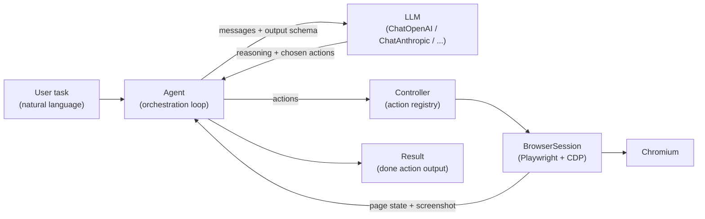
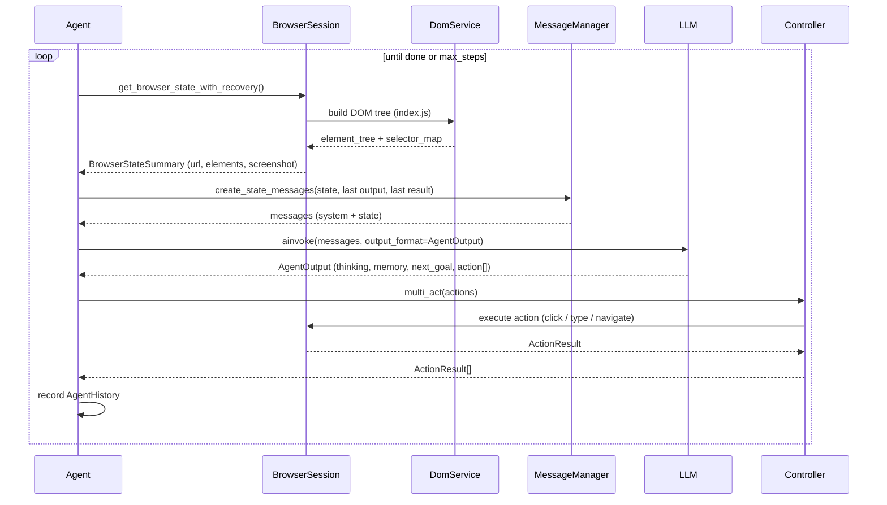
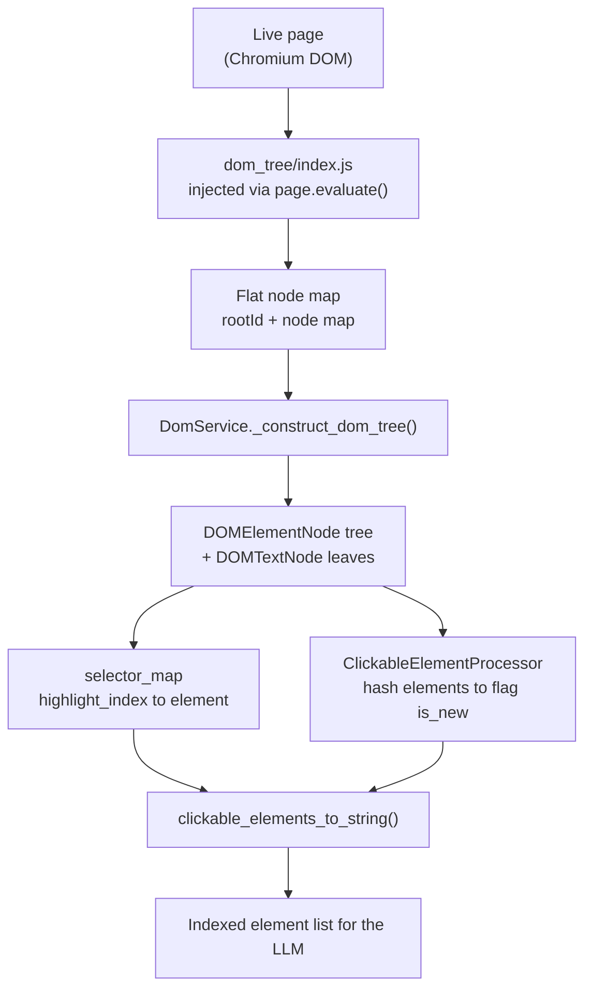
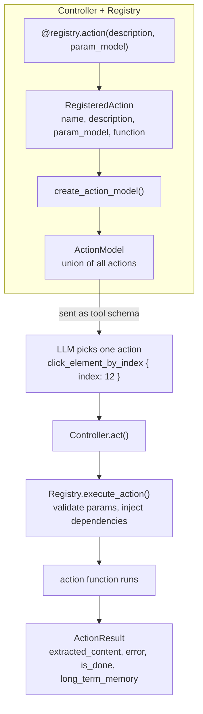
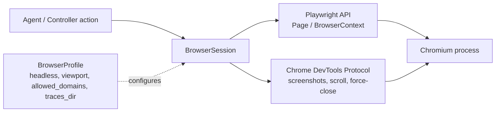
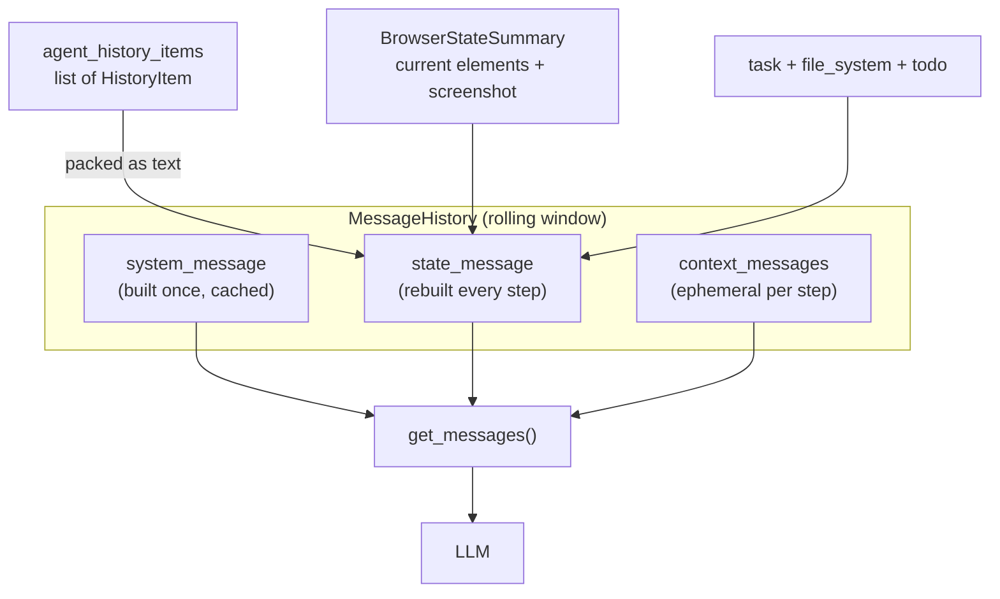
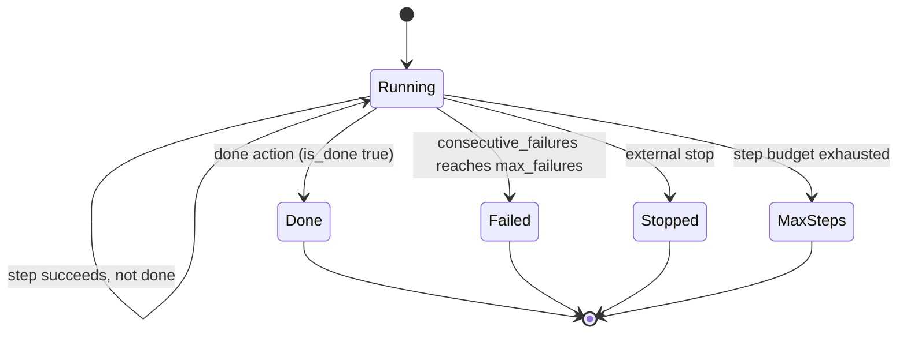

# Browser-Use: Architecture

Browser-use is a Python library that lets a language model drive a real web browser. You give it a task in plain English ("find the cheapest flight to Lisbon next Tuesday"), and it opens Chromium through Playwright, reads the page, decides what to click or type, does it, looks again, and repeats until the task is done.

The core idea is a loop: perceive the page, decide on an action, act, observe the result. The LLM is the decision maker; everything else exists to turn a live web page into text the model can reason about and to turn the model's chosen action back into a real browser event.

This document builds the architecture up one layer at a time.

## The big picture

At the top level there are four moving parts. The `Agent` runs the loop. The `LLM` makes each decision. The `Controller` holds the set of actions the agent is allowed to take. The `BrowserSession` is the bridge to a real Chromium instance via Playwright.

The agent never talks to the browser directly to decide things, and the LLM never touches the browser at all. The agent sits in the middle, shuttling page state to the model and the model's chosen actions to the browser.

## The agent loop, one step at a time

The public entry point is `Agent.run(max_steps=100)`. It calls `Agent.step()` repeatedly. Each step is a single pass of perceive, decide, act, recorded as one `AgentHistory` entry.

Inside a step the agent first gathers the current browser state, then asks the message manager to assemble a prompt from that state plus the previous step's output and result. It calls the LLM with a structured-output schema (`AgentOutput`), parses the reply into a list of actions, executes them through the controller, and writes the outcome into history. The loop ends when the model emits the `done` action, when failures pile up past `max_failures`, or when the step budget runs out.

The model's reply is the `AgentOutput` pydantic model. Its reasoning fields are fixed and required: `evaluation_previous_goal` (did the last action work), `memory` (a short running note of progress), `next_goal` (what to do now), an optional `thinking` block, and `action`, a list of one or more actions to run this step. Requesting these as a structured schema rather than free text is what makes the reply parseable every time.

## How a page becomes context

An LLM cannot read a rendered web page. Browser-use turns the live DOM into a compact, indexed text list, and optionally a screenshot.

`DomService` injects a JavaScript file (`dom/dom_tree/index.js`) into the page and runs it with `page.evaluate()`. The script walks the real DOM, decides which elements are interactive and visible, assigns each a running `highlight_index`, and returns a flat node map. Python rebuilds that into a tree of `DOMElementNode` and `DOMTextNode` objects and a `selector_map` that maps each `highlight_index` back to its element. A separate `ClickableElementProcessor` hashes every interactive element so the system can flag which ones are new since the last step.

The serialized list is what the model actually sees. Each interactive element becomes one line like `[12]<button>Login />` or, for an element that just appeared, `*[5]<input type=text placeholder=Search... />`. The leading number is the `highlight_index`. When the model later says "click element 12", the agent resolves `12` through the `selector_map` to a concrete DOM node. If vision is enabled, the screenshot is attached alongside this text, and the highlight numbers drawn on the page line up with the indices in the list.

## Actions and the registry

The actions the agent can take are not hardcoded into the loop. The `Controller` owns a `Registry`, and every action is a function registered with the `@registry.action(...)` decorator. The decorator captures the action's name, a description, and a pydantic `param_model` describing its arguments.

At setup time the registry combines every registered action into a single dynamic `ActionModel` (a union of all actions). That model's JSON schema is what gets handed to the LLM as its available tools, so the model can only ever emit a well-formed call to a real action. The default set includes `go_to_url`, `click_element_by_index`, `input_text`, `scroll`, `send_keys`, `switch_tab`, `extract_structured_data`, `done`, and more; custom actions plug in the same way.

When an action runs, `Registry.execute_action()` validates the model's arguments against the action's `param_model` and then injects whatever dependencies the function asks for by name: `browser_session`, the current Playwright `page`, a `page_extraction_llm` for sub-tasks, the `file_system`, and others. Every action returns an `ActionResult`, whose fields (`extracted_content`, `error`, `is_done`, `long_term_memory`) flow back into the agent's history and, on the next step, into the prompt.

## Browser control

The actions talk to the browser through `BrowserSession`, which wraps Playwright. It launches or connects to Chromium, manages tabs and contexts, and exposes the higher-level methods actions call: `navigate`, `get_current_page`, `get_state_summary`, `take_screenshot`.

In several places it bypasses Playwright and speaks the Chrome DevTools Protocol (CDP) directly, for screenshots, scrolling, and force-closing pages, because plain Playwright calls can hang on a crashed or blocked page. A `BrowserProfile` supplies the configuration (headless or not, viewport size, allowed domains, trace directory) that fans out to Playwright's launch and context options.

The state the agent reads each step, the `BrowserStateSummary`, comes straight from this layer. It carries the URL, title, open tabs, the screenshot, and (inherited from `DOMState`) the `element_tree` and `selector_map` produced by the DOM extraction step above. That object is the single perception payload that gets folded into the next prompt.

## Memory: the rolling message window

A naive agent would resend its entire transcript every step, and the prompt would grow without bound. Browser-use instead keeps a fixed-size window. The `MessageManager` holds a `MessageHistory` with exactly three slots: one `system_message` (built once and cached), one `state_message` (rebuilt fresh every step), and a short list of ephemeral `context_messages`.

Progress across steps is not kept as a growing pile of messages. Instead each step is condensed into a `HistoryItem` (its evaluation, memory note, goal, and action results), and those items are rendered into text and packed into the single state message, capped by `max_history_items`. So the model always sees one system prompt, one current-state message containing the recent history plus the live page, and nothing more.

## When the loop ends

`run()` iterates up to `max_steps`. Most steps just loop: the agent acts and observes again. It leaves the loop on four conditions. The clean exit is the model calling the `done` action, which sets `is_done` on the result. The agent also stops if consecutive failures reach `max_failures`, if it is stopped externally, or if it exhausts its step budget.

Whatever the exit, `run()` returns an `AgentHistoryList`, the full record of every step: what the model thought, what it did, the resulting page state, and token usage. The `done` action's text is the answer handed back to the caller.

## Putting it together

Each layer has one job. `DomService` turns a page into indexed text. The `Registry` turns Python functions into a tool schema and back. `BrowserSession` turns an action into a real browser event. The `MessageManager` keeps the prompt bounded. The `LLM` decides. And `Agent` runs the loop that connects them, one perceive-decide-act step at a time, until the task is done.
