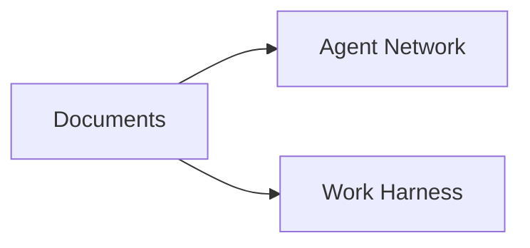

# SmallDocs

## Presentation

~~~slide
grid 100 56.25 bg=#FFFFFF
l 43 11.5 57 11.5 stroke=#2563EB strokeWidth=0.12
r 8 18 84 20 text=title align=center valign=center | SmallDocs
l 43 41 57 41 stroke=#1C1917 strokeWidth=0.08
~~~

### The shift in work

~~~slide
grid 100 56.25 bg=#FFFFFF
l 6 9.5 94 9.5 stroke=#D4CFC9 strokeWidth=0.05
r 6 3 88 6 text=subtitle align=center valign=center | The way we work is changing
r 4 11.5 43 4 align=center valign=center text=body | **New platforms for work**
r 53 11.5 43 4 align=center valign=center text=body | **Agents for every job**
r 53 15.6 43 2 align=center valign=center text=caption color=#A8A29E | CODEX USAGE SHARE
r 6 16.5 20 3 align=center valign=center text=caption color=#A8A29E | AGENTS
r 27 16.5 19 3 align=center valign=center text=caption color=#A8A29E | HARNESSES
r 6 20 20 4 fill=#DBEAFE radius=0.4 align=center valign=center | Claude
r 6 25 20 4 fill=#DBEAFE radius=0.4 align=center valign=center | ChatGPT
r 6 30 20 4 fill=#DBEAFE radius=0.4 align=center valign=center | Gemini
r 6 35 20 4 fill=#DBEAFE radius=0.4 align=center valign=center | DeepSeek
r 6 40 20 4 fill=#DBEAFE radius=0.4 align=center valign=center | Kimi
r 27 20 19 4 stroke=#1C1917 strokeWidth=0.03 radius=0.4 align=center valign=center | Claude Code
r 27 25 19 4 stroke=#1C1917 strokeWidth=0.03 radius=0.4 align=center valign=center | Codex
r 27 30 19 4 stroke=#1C1917 strokeWidth=0.03 radius=0.4 align=center valign=center | Cursor
r 27 35 19 4 stroke=#1C1917 strokeWidth=0.03 radius=0.4 align=center valign=center | opencode
r 27 40 19 4 stroke=#1C1917 strokeWidth=0.03 radius=0.4 align=center valign=center | Pi
r 53 17.6 43 28 |
  ```chart
  {
    "type": "line",
    "labels": ["3/15","3/22","3/29","4/5","4/12","4/19","4/26","5/3","5/10","5/17"],
    "datasets": [
      { "label": "Developer",        "values": [89,88,87,86,84,82,80,78,76,74], "color": "#1C1917" },
      { "label": "Knowledge Worker", "values": [7,8,9,9,10,11,13,15,18,20],      "color": "#2563EB" },
      { "label": "Personal",         "values": [4,4,4,4,4,4,4,5,5,5],            "color": "#93C5FD" }
    ],
    "min": 0, "max": 100, "suffix": "%", "tension": 0.4,
    "dataLabels": false, "legendPosition": "top", "xLabel": "Date"
  }
  ```
~~~

~~~slide
grid 100 56.25 bg=#FFFFFF
r 6 3.5 88 6 text=subtitle align=center valign=center | How is work changing?
l 6 10 94 10 stroke=#D4CFC9 strokeWidth=0.05
r 10 12 80 42 |
  ```mermaid
  flowchart TB
    A1["Depth"] --> A2["Maximise agent expression"]
    B1["Complexity / intelligence"] --> B2["Help humans understand<br/>(while agents stay productive)"]
    C1["Speed"] --> C2["Lightweight / sharable"]
    S1["Agents work, humans review"] --> S2["Agent-human collaboration"]
    A2 --> D["Better decisions"]
    B2 --> D
    C2 --> E["Faster"]
    S2 --> E
  ```
~~~

### The document gap

~~~slide
grid 100 56.25 bg=#FFFFFF
r 6 3.5 88 6 text=subtitle align=center valign=center | Old document formats don't fit this world
l 6 10 94 10 stroke=#D4CFC9 strokeWidth=0.05
r 6 11.5 28 2.5 align=center valign=center text=caption color=#A8A29E | TODAY'S FORMATS
r 44 11.5 50 2.5 align=left valign=center text=caption color=#A8A29E | WHERE THEY BREAK
r 6 15 13 16 stroke=#1C1917 strokeWidth=0.03 radius=0.6
icon 10 18.5 5 5 name=file-text color=#44403C
r 6 25.5 13 4 align=center valign=center | Word
r 21 15 13 16 stroke=#1C1917 strokeWidth=0.03 radius=0.6
icon 25 18.5 5 5 name=file-spreadsheet color=#44403C
r 21 25.5 13 4 align=center valign=center | Excel
r 6 33.5 13 16 stroke=#1C1917 strokeWidth=0.03 radius=0.6
icon 10 37 5 5 name=presentation color=#44403C
r 6 44 13 4 align=center valign=center | PowerPoint
r 21 33.5 13 16 stroke=#1C1917 strokeWidth=0.03 radius=0.6
icon 25 37 5 5 name=file color=#44403C
r 21 44 13 4 align=center valign=center | PDF
r 40 15 54 10 fill=#EEF2F7 radius=0.5
l 41 16 41 24 stroke=#2563EB strokeWidth=0.3
r 44 15 48 10 align=left valign=center text=body |
  **Not agent first**

  - XML, not Markdown
r 40 26.5 54 10 fill=#EEF2F7 radius=0.5
l 41 27.5 41 35.5 stroke=#2563EB strokeWidth=0.3
r 44 26.5 48 10 align=left valign=center text=body |
  **Unexpressive**

  - One domain per doc-type
r 40 38 54 11.5 fill=#EEF2F7 radius=0.5
l 41 39 41 48.5 stroke=#2563EB strokeWidth=0.3
r 44 38 48 11.5 align=left valign=center text=body |
  **Slow**

  - Heavy to open
  - Fiddly to share
  - Difficult to iterate on with an agent
~~~

### The answer

~~~slide
grid 100 56.25 bg=#FFFFFF
l 43 11.5 57 11.5 stroke=#2563EB strokeWidth=0.12
r 8 18 84 20 text=title align=center valign=center | SmallDocs are different
l 43 41 57 41 stroke=#1C1917 strokeWidth=0.08
~~~

---

## Business model

### Document focus builds opportunities



### Financial projections

```chart
{
  "type": "mixed",
  "title": "Revenue by layer, and gross margin",
  "subtitle": "Document format + Context + Work, by year. Revenue stacked (left, $M); gross margin (right).",
  "labels": ["Y1","Y2","Y3","Y4","Y5"],
  "datasets": [
    { "label": "Document format",  "type": "bar",  "values": [3.1, 7.0, 18.0, 34.0, 65.0], "color": "#2563EB", "yAxisID": "y" },
    { "label": "SmallDocs Network", "type": "bar", "values": [0, 2.0, 6.0, 13.0, 28.0],      "color": "#93C5FD", "yAxisID": "y" },
    { "label": "SmallDocs Work",   "type": "bar",  "values": [0, 0, 3.0, 7.0, 15.0],          "color": "#60A5FA", "yAxisID": "y" },
    { "label": "Gross margin",     "type": "line", "values": [95, 94, 86, 85, 84], "color": "#1C1917", "yAxisID": "y2", "tension": 0.3 }
  ],
  "stacked": true,
  "prefix": "$",
  "suffix": "M",
  "yLabel": "ARR ($M)",
  "y2Axis": "Gross margin",
  "y2Suffix": "%",
  "dataLabels": false,
  "legendPosition": "top"
}
```

### Model

```cells business/Model
format: A=plain B=$.0 C=$.0 D=$.0 E=$.0 F=$.0
Line,Y1,Y2,Y3,Y4,Y5
Document format revenue,=Drivers!B2*Drivers!B3*12,=Drivers!C2*Drivers!C3*12,=Drivers!D2*Drivers!D3*12,=Drivers!E2*Drivers!E3*12,=Drivers!F2*Drivers!F3*12
SmallDocs Network revenue,=Drivers!B4*Drivers!B5*12,=Drivers!C4*Drivers!C5*12,=Drivers!D4*Drivers!D5*12,=Drivers!E4*Drivers!E5*12,=Drivers!F4*Drivers!F5*12
SmallDocs Work revenue,=Drivers!B6*Drivers!B7*12,=Drivers!C6*Drivers!C7*12,=Drivers!D6*Drivers!D7*12,=Drivers!E6*Drivers!E7*12,=Drivers!F6*Drivers!F7*12
Total revenue,=B2+B3+B4,=C2+C3+C4,=D2+D3+D4,=E2+E3+E4,=F2+F3+F4
Gross profit,=B2*Drivers!B8+B3*Drivers!B9+B4*Drivers!B10,=C2*Drivers!C8+C3*Drivers!C9+C4*Drivers!C10,=D2*Drivers!D8+D3*Drivers!D9+D4*Drivers!D10,=E2*Drivers!E8+E3*Drivers!E9+E4*Drivers!E10,=F2*Drivers!F8+F3*Drivers!F9+F4*Drivers!F10
Staff cost,=Drivers!B11*Drivers!B12,=Drivers!C11*Drivers!C12,=Drivers!D11*Drivers!D12,=Drivers!E11*Drivers!E12,=Drivers!F11*Drivers!F12
Other opex,=Drivers!B13,=Drivers!C13,=Drivers!D13,=Drivers!E13,=Drivers!F13
EBITDA,=B6-B7-B8,=C6-C7-C8,=D6-D7-D8,=E6-E7-E8,=F6-F7-F8
```

```cells business/Margins
format: A=plain B=%.0 C=%.0 D=%.0 E=%.0 F=%.0
Metric,Y1,Y2,Y3,Y4,Y5
Gross margin,=Model!B6/Model!B5,=Model!C6/Model!C5,=Model!D6/Model!D5,=Model!E6/Model!E5,=Model!F6/Model!F5
EBITDA margin,=Model!B9/Model!B5,=Model!C9/Model!C5,=Model!D9/Model!D5,=Model!E9/Model!E5,=Model!F9/Model!F5
```

```cells business/Drivers
format: A=plain B=number C=number D=number E=number F=number
Driver,Y1,Y2,Y3,Y4,Y5
Document format seats,17000,39000,100000,189000,361000
Document format price ($/seat/mo),15,15,15,15,15
Context seats,0,4200,12500,27100,58300
Context price ($/seat/mo),40,40,40,40,40
Work seats,0,0,3100,7300,15600
Work price ($/seat/mo),80,80,80,80,80
Document format gross margin,0.95,0.95,0.95,0.95,0.95
Context gross margin,0.90,0.90,0.90,0.90,0.90
Work gross margin,0.25,0.25,0.25,0.25,0.25
Headcount,10,25,70,140,250
Cost per head ($/yr),200000,200000,200000,200000,200000
Other opex ($/yr),2000000,5000000,10000000,16000000,25000000
```

---

## Market sizing

~~~slide
grid 100 56.25 bg=#FFFFFF
r 6 3 80 3 text=caption color=#A8A29E align=left | BOTTOM-UP · BACK THE SEATS OUT OF THE SPEND
r 6 5.5 88 7 text=subtitle color=#1C1917 align=left | Measured spend ÷ measured per-seat budget = seats

r 6 13 82 6 text=body color=#57534E align=left | We charge $15/user/month ($180/year).

r 6 20 33 7 align=left valign=center color=#57534E padding=1.2 stroke=#D4CFC9 strokeWidth=0.04 | $37B [1] ÷ $1,358/employee [2] = **27M**
r 6 29 33 7 align=left valign=center color=#57534E padding=1.2 stroke=#D4CFC9 strokeWidth=0.04 | $8.4B [1] ÷ $360/seat [3] = **23M**
r 6 38 33 7 align=left valign=center color=#57534E padding=1.2 stroke=#D4CFC9 strokeWidth=0.04 | OpenAI 7-9M [4] + Copilot 15-20M [5] = **25M**

a 39 23.5 45 34 stroke=#2563EB strokeWidth=0.06
a 39 32.5 45 34 stroke=#2563EB strokeWidth=0.06
a 39 41.5 45 34 stroke=#2563EB strokeWidth=0.06

r 46 28 22 12 fill=#2563EB color=#FAFAF9 align=center valign=center |
  **20-30M**
  AI-equipped seats today

r 65 24.5 13 3 text=caption color=#1D4ED8 align=center | × $180 / yr
a 68.5 34 73.5 34 stroke=#2563EB strokeWidth=0.06

r 74 28 21 12 stroke=#2563EB strokeWidth=0.06 color=#1D4ED8 align=center valign=center |
  **$3.6-5.4B**
  TAM at our $15/seat/month

r 6 50 89 3 text=caption color=#A8A29E align=left | Three unrelated methods converge on roughly 25M seats and the disclosed vendor tallies match.
~~~

~~~slide
grid 100 56.25 bg=#FFFFFF
r 6 3 70 3 text=caption color=#A8A29E align=left | THE TAILWIND · A MARKET COMPOUNDING 40%+ A YEAR
r 6 5.5 58 7 text=subtitle color=#1C1917 align=left | The market we are early to
r 66 6 28 4 text=body color=#1D4ED8 align=right | **43%+ CAGR** [6]

r 6 13 56 3 text=caption color=#A8A29E align=left | AI agents market, annual revenue ($B); 2030 and 2035 are forecasts

l 8 40 90 40 stroke=#D4CFC9 strokeWidth=0.04

r 12 36.4 11 3.6 fill=#DBEAFE
r 33 35.65 11 4.35 fill=#93C5FD
r 54 30.75 11 9.25 fill=#60A5FA
r 75 18 11 22 fill=#2563EB

r 9.5 33.4 16 2.8 align=center color=#1C1917 | **$7.9B** [6]
r 30.5 32.6 16 2.8 align=center color=#1C1917 | **$11.5B** [6]
r 51.5 27.6 16 2.8 align=center color=#1C1917 | **$52B** [7]
r 72.5 14.8 16 2.8 align=center color=#1D4ED8 | **$294B** [6]

r 9.5 40.5 16 2.6 text=caption align=center color=#6b6560 | 2025
r 30.5 40.5 16 2.6 text=caption align=center color=#6b6560 | 2026
r 51.5 40.5 16 2.6 text=caption align=center color=#6b6560 | 2030
r 72.5 40.5 16 2.6 text=caption align=center color=#6b6560 | 2035

r 6 44 88 6 stroke=#2563EB strokeWidth=0.05 align=left valign=center color=#57534E padding=1.2 |
  **We believe SmallDocs lifts an agent-first worker's productivity 2.5-5%.** At 2.5%: on an output base near $120k that is about $3,000/yr of value per seat today. As agent spend per employee grows, the value SmallDocs delivers grows.
r 6 50.5 88 2.8 text=caption color=#A8A29E align=left | Market sizing: Precedence Research [6] (2025/2026/2035, 43.6% CAGR); MarketsandMarkets [7] ($52.6B by 2030, 46.3% CAGR). The 2.5-5% gain and the $120k output base are illustrative.
~~~

### Sources

**[1] Menlo Ventures**, *2025: The State of Generative AI in the Enterprise* - $37B total enterprise generative-AI spend (up 3.2x YoY), $19B application layer, $8.4B horizontal AI. Measured 2025 budgets (survey), not run-rate. [menlovc.com](https://menlovc.com/perspective/2025-the-state-of-generative-ai-in-the-enterprise/)

**[2] Federal Reserve Bank of Atlanta** (May 2026) - AI spend per employee $1,358/yr for US firms in 2025, rising about 50% to $2,068 in 2026 (professional and business services $3,470). Skewed (median firm well below the average) and includes infrastructure and API, not only seats; the loosest of the inputs. [atlantafed.org](https://www.atlantafed.org/research-and-data/publications/policy-hub-macroblog/2026/05/06/how-much-firms-spending-on-ai-and-what-will-happen-to-headcounts)

**[3] Vendor list pricing** (2026) - Microsoft 365 Copilot $30/user/month ($360/year) for enterprise; incumbent AI seats roughly $30-60/month (Copilot Business $18-21, ChatGPT Business $20-30, ChatGPT Enterprise $60-100+). [Microsoft Copilot pricing](https://www.microsoft.com/en-us/microsoft-365-copilot/pricing/enterprise) · [ChatGPT pricing](https://openai.com/business/chatgpt-pricing/)

**[4] OpenAI**, *1 million business customers* (Nov 2025) - more than 7 million ChatGPT for Work seats (up 40% in two months; Enterprise seats up ninefold year-over-year). [openai.com](https://openai.com/index/1-million-businesses-putting-ai-to-work/)

**[5] Microsoft** - 15-20M Microsoft 365 Copilot paid seats, from Microsoft's FY2026 earnings calls (15M reported Jan 2026, 20M reported Apr 2026). [nojitter.com](https://www.nojitter.com/ai-automation/microsoft-365-copilot-hits-20-million-paid-seats)

**[6] Precedence Research** - AI agents market: $7.92B (2025), $11.55B (2026), about $294.66B (2035), 43.57% CAGR (2026-2035). Ten-year-out figures are forecasts, not measured. [precedenceresearch.com](https://www.precedenceresearch.com/ai-agents-market)

**[7] MarketsandMarkets** - AI agents market $7.84B (2025) growing to $52.62B by 2030, 46.3% CAGR. Used as the 2030 cross-check on the Precedence trajectory. [marketsandmarkets.com](https://www.marketsandmarkets.com/PressReleases/ai-agents.asp)

The seat convergence (23-27M across three unrelated methods, matching the disclosed vendor tallies) is the argument: no single source carries the 25M figure.

---

## Retention

```chart
{
  "type": "line",
  "title": "Returning visits by weekly cohort",
  "subtitle": "Repeat visits each week after signup, by cohort. Partial current week excluded.",
  "labels": ["Wk 1","Wk 2","Wk 3","Wk 4","Wk 5","Wk 6","Wk 7","Wk 8"],
  "datasets": [
    { "label": "Wk 0 C", "values": [353, 155, 308, 68, 57, 54, 50, 40], "color": "#2563EB" },
    { "label": "Wk 1 C", "values": [40, 80, 30, 31, 9, 12, 3, null], "color": "#1C1917" },
    { "label": "Wk 2 C", "values": [17, 6, 7, 9, 1, 2, null, null], "color": "#60A5FA" },
    { "label": "Wk 3 C", "values": [273, 89, 47, 43, 34, null, null, null], "color": "#93C5FD" },
    { "label": "Wk 4 C", "values": [34, 5, 13, 22, null, null, null, null], "color": "#A8A29E" },
    { "label": "Wk 5 C", "values": [11, 70, null, null, null, null, null, null], "color": "#1D4ED8" }
  ],
  "tension": 0.3, "dataLabels": false,
  "xLabel": "Weeks since first visit", "yLabel": "Returning visits"
}
```

[smalldocs.org/analytics](https://smalldocs.org/analytics)
